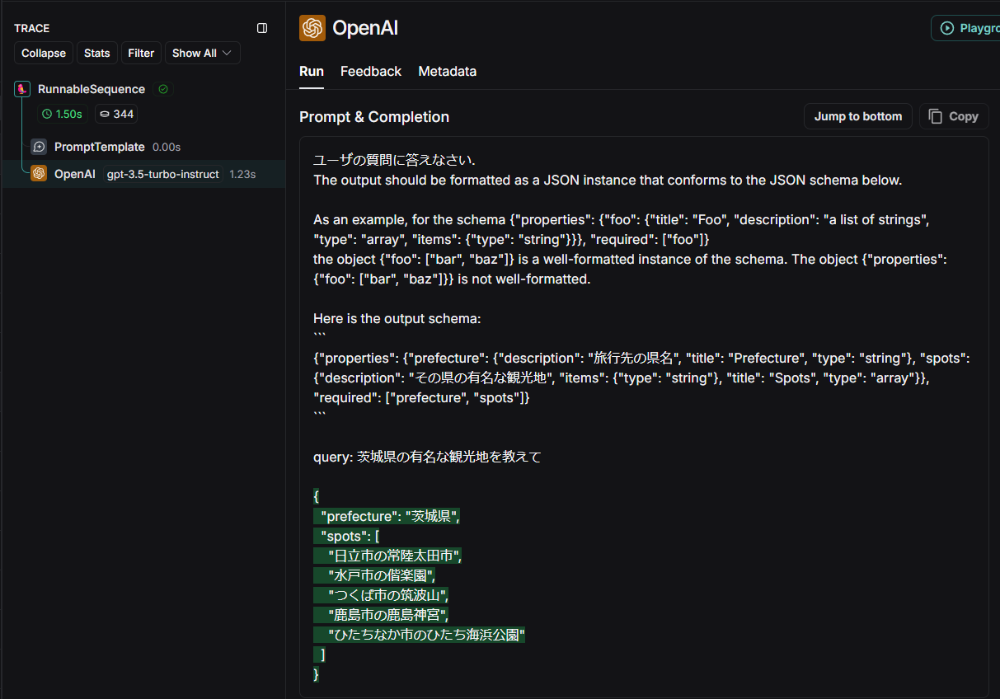
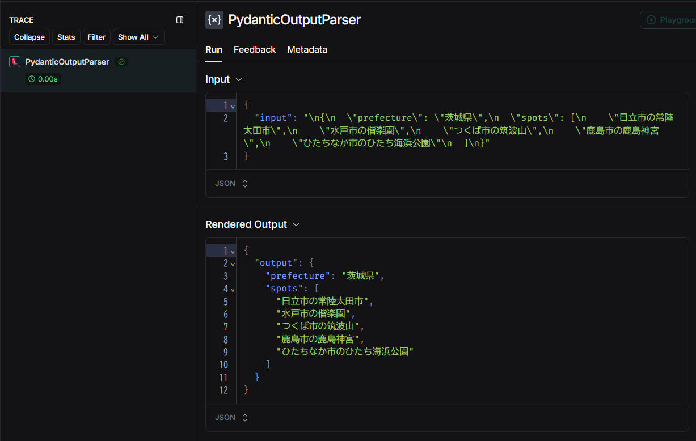
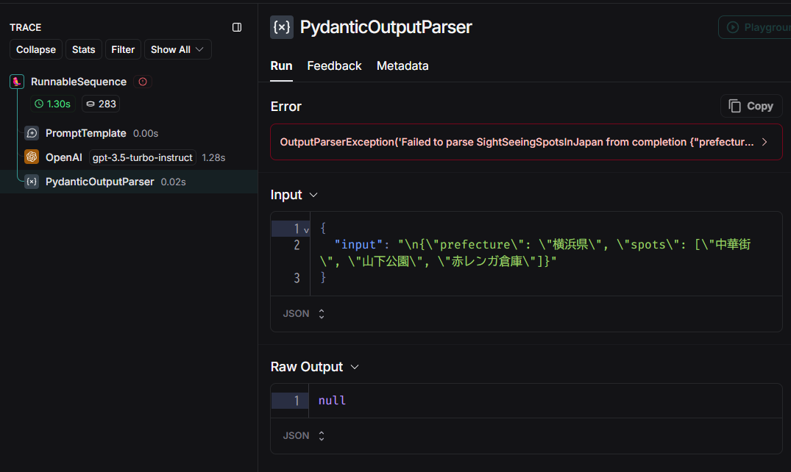
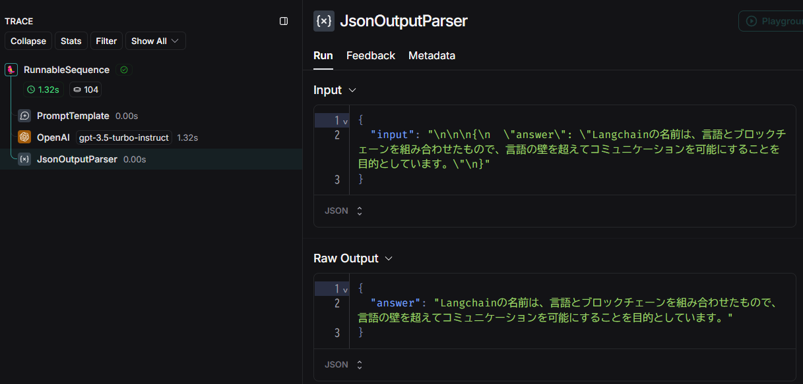
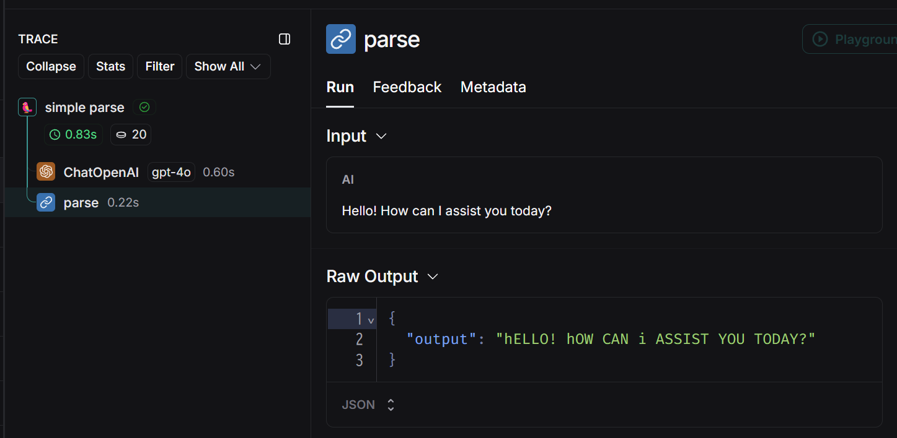

## Output parsers チュートリアル

Output parsers に関するチュートリアルを実行するためのソースファイル群です。

参考：[langchain Output parsers](https://python.langchain.com/docs/how_to/#output-parsers)

## 実行方法

1. `.env` ファイルを作成して環境変数を記述してください。

```
OPENAI_API_KEY="<your-openai-api-key>"
HF_TOKEN="<your-hf-token>"

# Langsmithでトレースする場合は以下4つが必要
# LANGCHAIN_PROJECTは任意の名前を設定できる
LANGCHAIN_TRACING_V2=true
LANGCHAIN_ENDPOINT="https://api.smith.langchain.com"
LANGCHAIN_API_KEY="<your-langsmith-api-key>"
LANGCHAIN_PROJECT="output-parsers-tutorial"
```

2. `Dockerfile` を使用してビルドします。

```bash
docker build -t output-parsers .
```

3. ビルドしたイメージを実行してください。`-v`オプションでボリュームをマウントすると、ソースコードの修正がコンテナ環境にも反映されます。

Windows(cmd)の場合
```bash
docker run -it --rm -v "%cd%":/home/user/app --name output-parsers output-parsers /bin/bash
```

4. 所望のスクリプトを実行してください。

```bash
python output_parser_structured.py
```

5. 終了する際は`exit`を入力してください

```bash
exit
```

## ソースコード

### LLMの応答を構造化されたフォーマットに変換する方法

[output_parser_structured.py](output_parser_structured.py)

参考：[How to use output parsers to parse an LLM response into structured format](https://python.langchain.com/docs/how_to/output_parser_structured/)

`PydanticOutputParser` の使用方法について説明します。
まず、データ構造を定義します。

```python
from pydantic import BaseModel, Field, model_validator
from typing import List, ClassVar

class SightSeeingSpotsInJapan(BaseModel):
    prefecture: str = Field(description="旅行先の県名")
    spots: List[str] = Field(description="その県の有名な観光地")

    # インスタンス変数でないことを示すときに ClassVar を使う
    # Ref https://docs.python.org/ja/3/library/typing.html#typing.ClassVar
    JAPAN_PREFERCTURES: ClassVar[List[str]] = [
        "北海道", "青森県", ..., "沖縄県"
    ]

    # You can add custom validation logic easily with Pydantic.
    @model_validator(mode="before")
    @classmethod
    def check_prefecture(cls, values: dict) -> dict:
        prefecture = values.get("prefecture")
        if prefecture not in cls.JAPAN_PREFERCTURES:
            raise ValueError("日本の都道府県を指定してください。")
        return values
```

`parser` を定義します。`.get_format_instructions()` で変換する際の指示文を受け取れます。

```python
# Set up a parser + inject instructions into the prompt template.
parser = PydanticOutputParser(pydantic_object=SightSeeingSpotsInJapan)

print(parser.get_format_instructions())
"""
The output should be formatted as a JSON instance that conforms to the JSON schema below.

As an example, for the schema {"properties": {"foo": {"title": "Foo", "description": "a list of strings", "type": "array", "items": {"type": "string"}}}, "required": ["foo"]}
the object {"foo": ["bar", "baz"]} is a well-formatted instance of the schema. The object {"properties": {"foo": ["bar", "baz"]}} is not well-formatted.

Here is the output schema:
`
{"properties": {"prefecture": {"description": "旅行先の県名", "title": "Prefecture", "type": "string"}, "spots": {"description": "その県の有名な観光地", "items": {"type": "string"}, "title": "Spots", "type": "array"}}, "required": ["prefecture", "spots"]}
`
"""
```

指示文をプロンプトに埋め込み、チェーンでつないでものを `invoke()` します。

```python
# And a query intended to prompt a language model to populate the data structure.
prompt_and_model = prompt | model
output = prompt_and_model.invoke({"query": "茨城県の有名な観光地を教えて"})
print(type(output)) # str
print(output)
"""
{
"prefecture": "茨城県",
"spots": [
    "日立市の常陸太田市",
    "水戸市の偕楽園",
    "つくば市の筑波山",
    "鹿島市の鹿島神宮",
    "ひたちなか市のひたち海浜公園"
]
}
"""
```



`parser` に通すと、定義したデータ型に変換されます。

```python
response = parser.invoke(output)
print(type(response))
# <class '__main__.main_pydantic_output_parser.<locals>.SightSeeingSpotsInJapan'>

print(response)
# prefecture='茨城県' spots=['日立市の常陸太田市', '水戸市の偕楽園', 'つくば市の筑波山', '鹿島市の鹿島神宮', 'ひたちなか市のひたち海浜公園']
```



実用上は `parser` もチェーンにつないでしまえばよいです。

```python
chain = prompt | model | parser
response = chain.invoke({"query": "茨城県の有名な観光地を教えて"})
print(response)
# prefecture='茨城県' spots=['日立市の常陸太田市', '水戸市の偕楽園', 'つくば市の筑波山', '鹿島市の鹿島神宮', 'ひたちなか市のひたち海浜公園']
```

入力が不適な場合、データ構造で定義した `validator` によりエラーが発生します。
```python
# 都道府県名が不適なので validation error が発生する
response = chain.invoke({"query": "横浜県の有名な観光地を教えて"})
```



`SimpleJsonOutputParser` は、json 形式で書かれたLLMの応答（文字列）を json に変換します。

```python
from langchain.output_parsers.json import SimpleJsonOutputParser

model = OpenAI(model_name="gpt-3.5-turbo-instruct", temperature=0.0)
json_prompt = PromptTemplate.from_template(
    "Return a JSON object with an `answer` key that answers the following question: {question}"
)
json_parser = SimpleJsonOutputParser()
chain = json_prompt | model | json_parser
response = (json_prompt | model).invoke({"question": "Langchainの名前の由来を教えてください"})
print(type(response)) # str

response = chain.invoke({"question": "Langchainの名前の由来を教えてください"})
print(type(response)) # dict
print(response)
# {'answer': 'Langchainの名前は、言語とブロックチェーンを組み合わせたもので、言語の壁を超えてコミュニケーションを 可能にすることを目的としています。'}
```



### Output Parser を自作する方法

[output_parser_custom.py](output_parser_custom.py)

参考：[How to create a custom Output Parser](https://python.langchain.com/docs/how_to/output_parser_custom/)

方法は2つです。

1. （推奨）`RunnableLambda` あるいは `RunnableGenerator` を使って `chain` につなげる
2. （非推奨）`BaseOutputParser` あるいは `BaseGenerationOutputParser` を継承する

2の方法は実装量が増えてしまうので非推奨とされています。
ここでは1の方法のみ説明します。

大文字小文字をひっくり返す `parse()` 関数を定義し、`model` とチェーンでつなげるとパースされます。
`parse` はただの Python の関数ですが、LCEL記法でつなげることで `RunnableLambda(parse)` で `Runnable` に変換したことと同じになります。

```python
model = ChatOpenAI(model="gpt-4o")

def parse(ai_message: AIMessage) -> str:
    """Parse the AI message."""
    return ai_message.content.swapcase()

# | を使用して parse をつなげた場合、自動的に Runnable(parse) に変換される。
chain = model | parse
res = chain.invoke("Just say Hello!", config={"run_name": "simple parse"})
print(res) # hELLO!
```



ストリーミング機能を使いたい場合は `RunnableGenerator` を使います。

```python
from langchain_core.runnables import RunnableGenerator

def streaming_parse(chunks: Iterable[AIMessageChunk]) -> Iterable[str]:
    for chunk in chunks:
        yield chunk.content.swapcase()

# ストリーミング機能を維持しながら、カスタム出力パーサーなどのカスタム動作を実装したいときは RunnableGenerator を使う
streaming_parse = RunnableGenerator(streaming_parse)

chain = model | streaming_parse
for chunk in chain.stream("tell me about yourself in one sentence"):
    print(chunk, end="|", flush=True)
print()
# |i'M| AN| ai| LANGUAGE| MODEL| CREATED| BY| oPEN|ai|,| DESIGNED| TO| ASSIST| AND| PROVIDE| INFORMATION| ON| A| WIDE| RANGE| OF| TOPICS|.||
```
