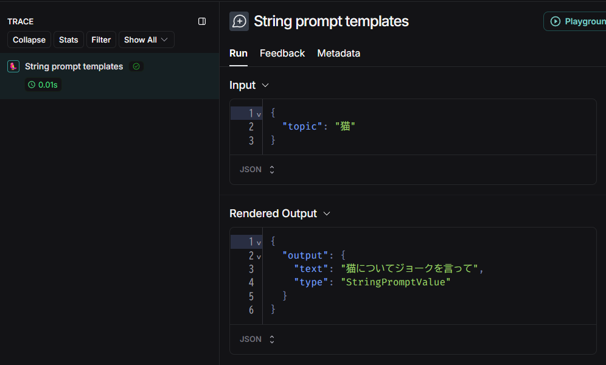
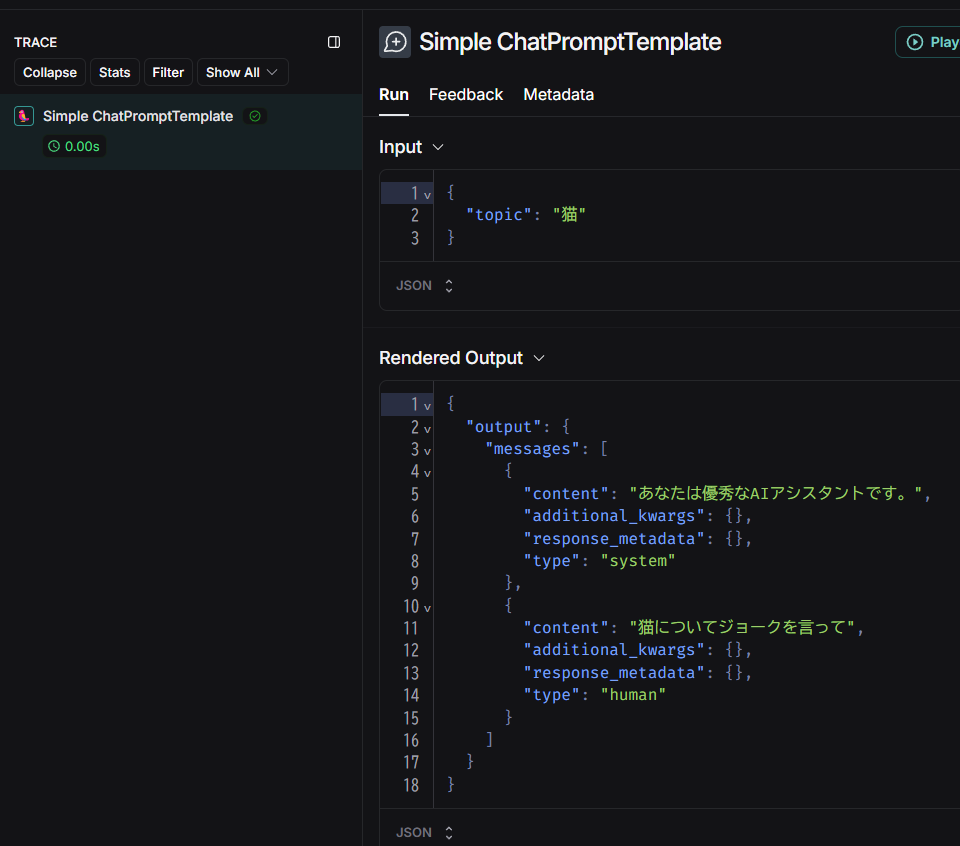
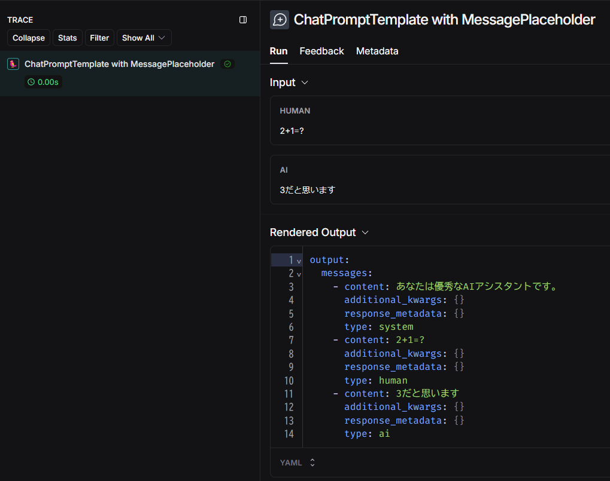
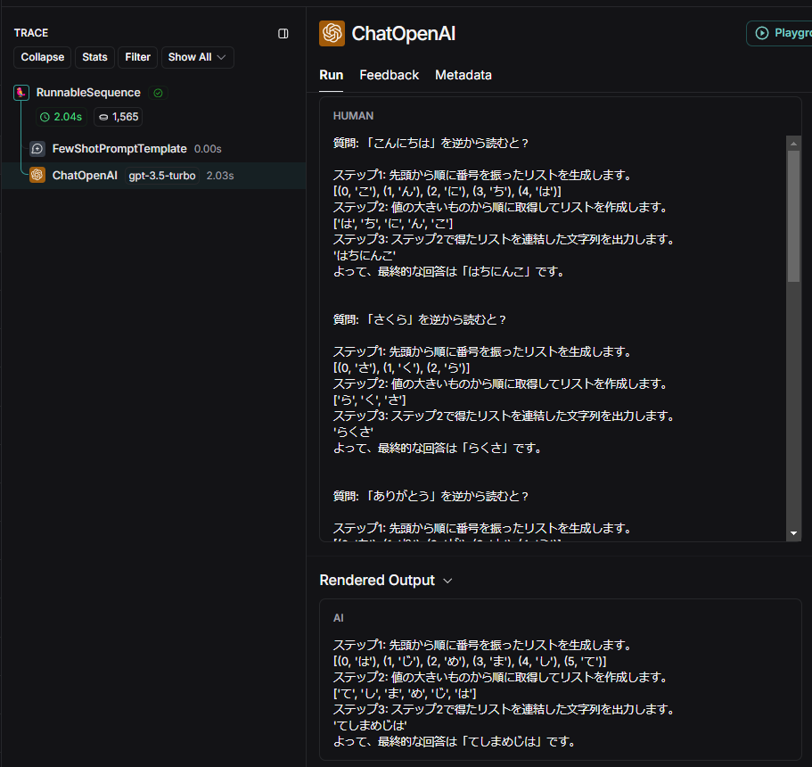
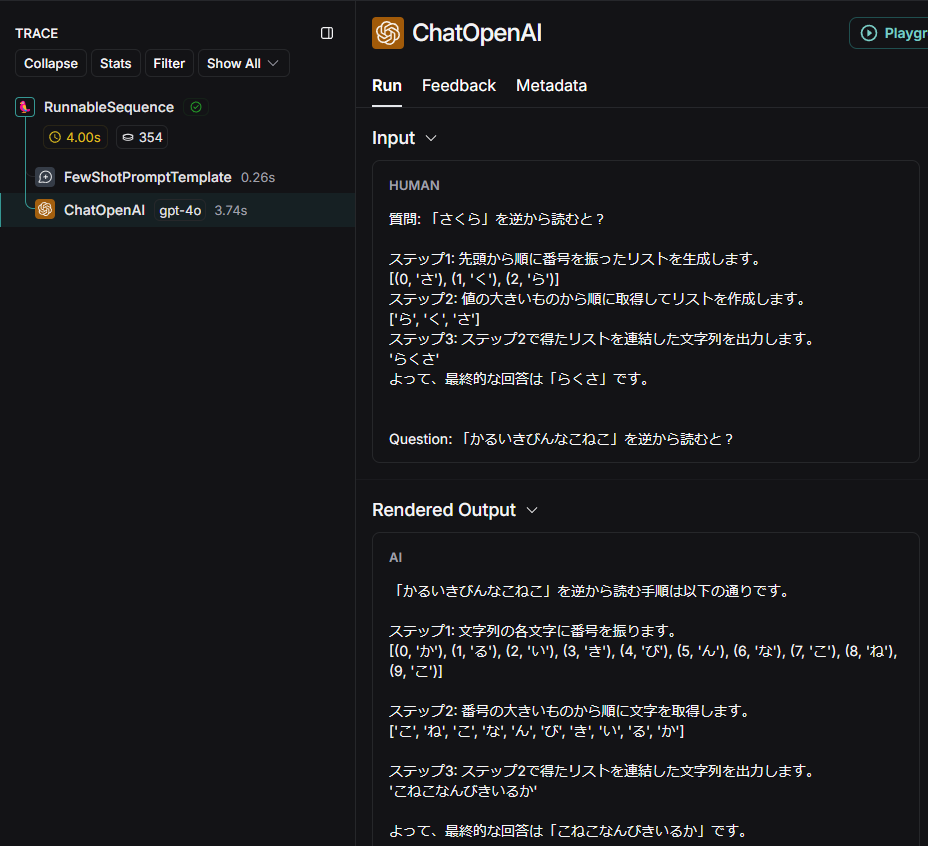

## Prompt templates チュートリアル

Prompt templates に関するチュートリアルを実行するためのソースファイル群です。

参考：[Prompt templates](https://python.langchain.com/docs/how_to/#prompt-templates)

## 実行方法

1. `.env` ファイルを作成して環境変数を記述してください。

```
OPENAI_API_KEY="<your-openai-api-key>"
HF_TOKEN="<your-hf-token>"

LANGCHAIN_TRACING_V2=true
LANGCHAIN_ENDPOINT="https://api.smith.langchain.com"
LANGCHAIN_API_KEY="<your-langsmith-api-key>"
LANGCHAIN_PROJECT="prompt-templates-tutorial"
```

2. `Dockerfile` を使用してビルドします。

```bash
docker build -t prompt-templates .
```

3. ビルドしたイメージを実行してください。`-v`オプションでボリュームをマウントすると、ソースコードの修正がコンテナ環境にも反映されます。

Windows(cmd)の場合
```bash
docker run -it --rm -v "%cd%":/home/user/app --name prompt-templates prompt-templates /bin/bash
```

4. 所望のスクリプトを実行してください。

```bash
python main_concepts.py
```

5. 終了する際は`exit`を入力してください

```bash
exit
```

## ソースコード

### Prompt templates のコンセプト

[main_concepts.py](main_concepts.py)

参考：[Prompt Templates](https://python.langchain.com/docs/concepts/prompt_templates/)

Prompt Templates のコンセプトガイドに書かれている内容について概説します。

プロンプトテンプレートは `PromptValue` を出力します。これはLLMや `ChatModel` に渡すことができ、文字列またはメッセージのリストに変換できます。

単一の文字列を入力する場合の例が以下です。

```python
from langchain_core.prompts import PromptTemplate

# 単一の文字列をフォーマットする
prompt_template = PromptTemplate.from_template("{topic}についてジョークを言って")

prompt_value = prompt_template.invoke({"topic": "猫"}, config={"run_name": "String prompt templates"})

print(type(prompt_value)) # <class 'langchain_core.prompt_values.StringPromptValue'>
print(prompt_value)       # text='猫についてジョークを言って'
```




複数のメッセージを入れる場合は `ChatPromptTemplate` を使います。

```python
from langchain_core.prompts import ChatPromptTemplate

prompt_template = ChatPromptTemplate([
    ("system", "あなたは優秀なAIアシスタントです。"),
    ("user", "{topic}についてジョークを言って")
])

prompt_value = prompt_template.invoke({"topic": "猫"}, config={"run_name": "Simple ChatPromptTemplate"})
print(type(prompt_value)) # <class 'langchain_core.prompt_values.ChatPromptValue'>
print(prompt_value)       
# messages=[SystemMessage(content='あなたは優秀なAIアシスタントです。', additional_kwargs={}, response_metadata={}), 
# HumanMessage(content='猫についてジョークを言って', additional_kwargs={}, response_metadata={})]
```



特定の位置にメッセージのリストを挿入するときは `MessagesPlaceholder` を使います。

```python
from langchain_core.prompts import ChatPromptTemplate, MessagesPlaceholder
from langchain_core.messages import HumanMessage, AIMessage

prompt_template = ChatPromptTemplate([
    ("system", "あなたは優秀なAIアシスタントです。"),
    MessagesPlaceholder("msgs")
])

prompt_value = prompt_template.invoke({"msgs": [HumanMessage(content="2+1=?"), AIMessage(content="3だと思います")]},
                                          config={"run_name": "ChatPromptTemplate with MessagePlaceholder"})
print(prompt_value) 
# messages=[SystemMessage(content='あなたは優秀なAIアシスタントです。', additional_kwargs={}, response_metadata={}), 
# HumanMessage(content='2+1=?', additional_kwargs={}, response_metadata={}), 
# AIMessage(content='3だと思います', additional_kwargs={}, response_metadata={})]
```



### Few-shot を使う方法

[few_shot_examples.py](few_shot_examples.py)

参考：[How to use few shot examples](https://python.langchain.com/docs/how_to/few_shot_examples/)

LLMにいくつかの具体例を渡して生成精度を高める方法を Few-shot プロンプティングといいます。

このサンプルでは与えられた文字列を逆順に読むタスクと与えられた数値のリストの合計の偶奇を判定させるタスクを定義し、それぞれの具体例を与えます。
各タスクは [こちら](https://bocek.co.jp/media/exercise/prompt-engineer-exercise/3087/) を参考にしました。

```python
examples = [
    {
        "question": "「こんにちは」を逆から読むと？",
        "answer": """
ステップ1: 先頭から順に番号を振ったリストを生成します。
[(0, 'こ'), (1, 'ん'), (2, 'に'), (3, 'ち'), (4, 'は')]
ステップ2: 値の大きいものから順に取得してリストを作成します。
['は', 'ち', 'に', 'ん', 'こ']
ステップ3: ステップ2で得たリストを連結した文字列を出力します。
'はちにんこ'
よって、最終的な回答は「はちにんこ」です。
"""
    },
    {
        "question": "「さくら」を逆から読むと？",
        "answer": """
ステップ1: 先頭から順に番号を振ったリストを生成します。
[(0, 'さ'), (1, 'く'), (2, 'ら')]
ステップ2: 値の大きいものから順に取得してリストを作成します。
['ら', 'く', 'さ']
ステップ3: ステップ2で得たリストを連結した文字列を出力します。
'らくさ'
よって、最終的な回答は「らくさ」です。
"""
    },
    {
        "question": "「ありがとう」を逆から読むと？",
        "answer": """
ステップ1: 先頭から順に番号を振ったリストを生成します。
[(0, 'あ'), (1, 'り'), (2, 'が'), (3, 'と'), (4, 'う')]
ステップ2: 値の大きいものから順に取得してリストを作成します。
['う', 'と', 'が', 'り', 'あ']
ステップ3: ステップ2で得たリストを連結した文字列を出力します。
'うとがりあ'
よって、最終的な回答は「うとがりあ」です。
"""
    },
    {
        "question": "次のグループの奇数を合計すると偶数になる。YesかNoか。[1、3、6、8、9、11、12]",
        "answer": """
ステップ1: グループの中に含まれる奇数が偶数個であれば奇数の合計は偶数、奇数個であれば奇数であることに気付く。
ステップ2: グループの中に含まれる奇数が何個あるか順に調べる。
奇数の数を odd_num として odd_num = 0 で初期化する。
1は奇数なのでodd_num = odd_num + 1 を実行して odd_num = 1 となる
3は奇数なのでodd_num = odd_num + 1 を実行して odd_num = 2 となる
6は偶数なのでodd_num = 2 のまま。
8は偶数なのでodd_num = 2 のまま。
9は奇数なのでodd_num = odd_num + 1 を実行して odd_num = 3 となる
11は奇数なのでodd_num = odd_num + 1 を実行して odd_num = 4 となる
12は偶数なのでodd_num = 4 のまま。
ステップ3: ステップ2で得た奇数の個数とステップ1の考え方より、奇数の個数が偶数個であるので、与えられたグループの奇数の和は偶数である。
よって、最終的な回答は「Yes」です。
"""
    },
    {
        "question": "次のグループの奇数を合計すると偶数になる。YesかNoか。[4、6、9、11、14、17、20]",
        "answer": """
ステップ1: グループの中に含まれる奇数が偶数個であれば奇数の合計は偶数、奇数個であれば奇数であることに気付く。
ステップ2: グループの中に含まれる奇数が何個あるか順に調べる。
奇数の数を odd_num として odd_num = 0 で初期化する。
4は偶数なのでodd_num = 0 のまま。
6は偶数なのでodd_num = 0 のまま。
9は奇数なのでodd_num = odd_num + 1 を実行して odd_num = 1 となる
11は奇数なのでodd_num = odd_num + 1 を実行して odd_num = 2 となる
14は偶数なのでodd_num = 2 のまま。
17は奇数なのでodd_num = odd_num + 1 を実行して odd_num = 3 となる
20は偶数なのでodd_num = 3 のまま。
ステップ3: ステップ2で得た奇数の個数とステップ1の考え方より、奇数の個数が奇数個であるので、与えられたグループの奇数の和は奇数である。
よって、最終的な回答は「No」です。
"""
    }
]
```

各具体例をフォーマットするためのプロンプトを用意します。

```python
example_prompt = PromptTemplate.from_template("質問: {question}\n{answer}")
```

`FewShotPromptTemplate` に `examples` と `example_prompt` を渡します。`suffix` は具体例の後にユーザのクエリを入れるときの文字列です。

```python
from langchain_core.prompts import FewShotPromptTemplate

prompt = FewShotPromptTemplate(
    examples=examples, # 例を格納したリスト
    example_prompt=example_prompt, # 各shotをフォーマットするためのプロンプト
    suffix="質問: {input}", # 例の後に入れる文字列
    input_variables=["input"],
)
```

実行してみましょう。

```python
from langchain_openai import ChatOpenAI

llm = ChatOpenAI(model="gpt-3.5-turbo", temperature=0.0)
chain = prompt | llm
response = chain.invoke({"input": "「はじめまして」を逆から読むと？"})
print(response.content)
```

出力は例えば以下のようになります。

```bash
ステップ1: 先頭から順に番号を振ったリストを生成します。
[(0, 'は'), (1, 'じ'), (2, 'め'), (3, 'ま'), (4, 'し'), (5, 'て')]
ステップ2: 値の大きいものから順に取得してリストを作成します。
['て', 'し', 'ま', 'め', 'じ', 'は']
ステップ3: ステップ2で得たリストを連結した文字列を出力します。
'てしまめじは'
よって、最終的な回答は「てしまめじは」です。
```



先程の例では5つの例がプロンプトに挿入されましたが、一部は無関係な具体例で無駄が発生しています。
そこで、あらかじめ各具体例をベクトルデータベースに格納し、クエリとの類似度検索を行って関連度の高い具体例だけを挿入することで入力トークンを節約できます。

`SemanticSimilarityExampleSelector` に具体例と埋め込みモデル、ベクトルストアのクラスを与えます。ここでは `k=1` として一つの具体例を挿入する One-shot を試します。

```python
from langchain_chroma import Chroma
from langchain_core.example_selectors import SemanticSimilarityExampleSelector
from langchain_openai import OpenAIEmbeddings

example_selector = SemanticSimilarityExampleSelector.from_examples(
    # This is the list of examples available to select from.
    examples,
    # This is the embedding class used to produce embeddings which are used to measure semantic similarity.
    OpenAIEmbeddings(),
    # This is the VectorStore class that is used to store the embeddings and do a similarity search over.
    Chroma,
    # This is the number of examples to produce.
    k=1,
    persist_directory="./questions_db" # **vectorstore_cls_kwargs に追加
)
```

今度は `example_selector` を与えます。

```python
prompt = FewShotPromptTemplate(
    example_selector=example_selector,
    example_prompt=example_prompt,
    suffix="Question: {input}",
    input_variables=["input"],
)
```

実行してみましょう。倒語の例は [こちら](https://blog.nazo2.net/4200/) を参考にしました。

```python
question = "「かるいきびんなこねこ」を逆から読むと？" # 子猫何匹いるか？
response = chain.invoke({"input": question})
print(response.content)
```

逆から読む具体例が一つだけ入っているのが分かります。



ちなみにこのタスクはLLMにとっては難しいらしく、`gpt-4o` でも正解する確率は20%程度でした。