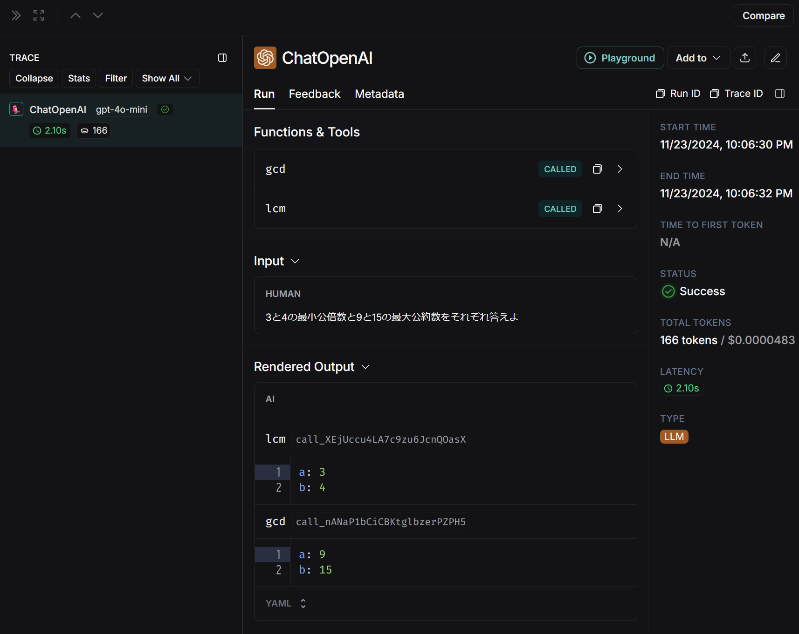
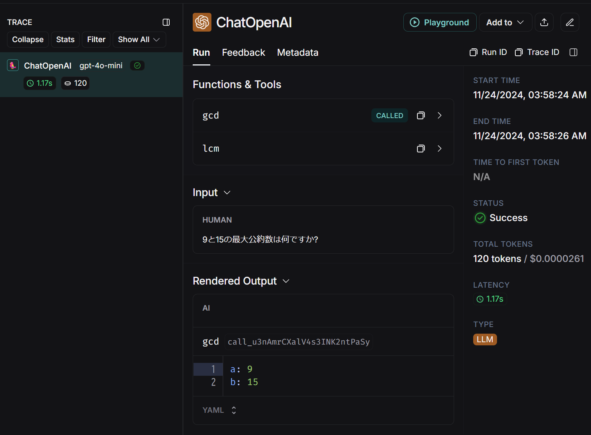
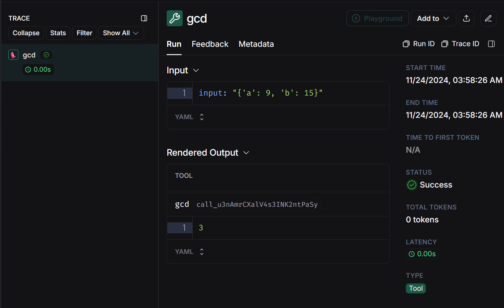

## Tools チュートリアル

Tools に関するチュートリアルを実行するためのソースファイル群です。

参考：[langchain Tools](https://python.langchain.com/docs/how_to/#tools)

## 実行方法

1. `.env` ファイルを作成して環境変数を記述してください。

```
OPENAI_API_KEY="<your-openai-api-key>"

# Langsmithでトレースする場合は以下4つが必要
# LANGCHAIN_PROJECTは任意の名前を設定できる
LANGCHAIN_TRACING_V2=true
LANGCHAIN_ENDPOINT="https://api.smith.langchain.com"
LANGCHAIN_API_KEY="<your-langsmith-api-key>"
LANGCHAIN_PROJECT="tools-tutorial"
```

2. `Dockerfile` を使用してビルドします。

```bash
docker build -t tools .
```

3. ビルドしたイメージを実行してください。`-v`オプションでボリュームをマウントすると、ソースコードの修正がコンテナ環境にも反映されます。

Windows(cmd)の場合
```cmd
docker run -it --rm -v "%cd%":/home/user/app --name tools tools /bin/bash
```

4. 所望のスクリプトを実行してください。

```bash
python custom_tools.py
```

5. 終了する際は`exit`を入力してください

```bash
exit
```

## ソースコード

### Tools の作成方法
[custom_tools.py](custom_tools.py)

参考：
[How to create tools](https://python.langchain.com/docs/how_to/custom_tools/)

`tool`デコレータを使う方法がもっとも単純です。

```python
@tool
def multiply(a: int, b: int) -> int:
    """Multiply two numbers."""
    return a * b

# Let's inspect some of the attributes associated with the tool.
print(multiply.name)        # multiply
print(multiply.description) # Multiply two numbers.
print(multiply.args)        # {'a': {'title': 'A', 'type': 'integer'}, 'b': {'title': 'B', 'type': 'integer'}}
print(multiply.return_direct) # False
print(multiply.invoke({"a": 2, "b": 3})) # 6
```

`StructuredTool.from_function()`を制御できることが増えます。

```python
def multiply(a: int, b: int) -> int:
    """Multiply two numbers."""
    return a * b

async def amultiply(a: int, b: int) -> int:
    """Multiply two numbers."""
    return a * b

calculator = StructuredTool.from_function(func=multiply, coroutine=amultiply)

print(calculator.invoke({"a": 2, "b": 3})) # 6
print(asyncio.run(calculator.ainvoke({"a": 2, "b": 5}))) # 10
```

文字列や`dict`を入力として受け付けるRunnableは`as_tool`メソッドでツールに変換できる。
```python
prompt = ChatPromptTemplate.from_messages(
    [("human", "Suggest a very {taste} snack in {country}. Just answer the name of the snack.")]
)

llm = ChatOpenAI(model="gpt-4o")
chain = prompt | llm | StrOutputParser()

# as_tool()でツールに変換できる
snack_tool = chain.as_tool(
    name="snack proposer", 
    description="Tool to suggest snacks in a specific country"
)

print(snack_tool.name)          # snack proposer
print(snack_tool.description)   # Tool to suggest snacks in a specific country
print(snack_tool.return_direct) # False
print(snack_tool.invoke({"taste": "sweet", "country": "USA"}))   # Funnel cake
print(snack_tool.invoke({"taste": "salty", "country": "Japan"})) # Kaki no Tane
```

`sync`の実装だけでも `ainvoke` を使えるが、いくつか注意点がある。
1. langchain はデフォルトで関数の計算コストが高いことを想定し、実行を別スレッドに委任する非同期実装を提供する
2. `async` で実装を進めている場合は、オーバーヘッドを減らすために同期ツールの代わりに非同期ツールを使用すべき
3. `sync` と `async` の両方の実装が必要な場合は `StructuredTool` か `BaseTool` を継承してツールを作る必要がある
4. `sync` の実行がすぐに終わるなら langchain の `async` をオーバーライドして単に `sync` を実行する形にすればいい
5. `async` の定義しかない `tool` で `invoke` しないでください（以下を参照）。

```python
@tool
async def multiply(a: int, b: int) -> int:
    """Multiply two numbers."""
    return a * b

# async の定義しかない tool で invoke を使うことはできないし、使うべきではない
try:
    multiply.invoke({"a": 2, "b": 3}) # エラー
except NotImplementedError:
    print("Raised not implemented error. You should not be doing this.")
```

エラーは `ToolException` を投げるとよい

```python
from langchain_core.tools import ToolException

def get_weather(city: str) -> int:
    """Get weather for the given city."""
    raise ToolException(f"Error: There is no city by the name of {city}.")

### boolを設定する方法 ###
get_weather_tool = StructuredTool.from_function(
    func=get_weather,
    handle_tool_error=True,
)

print(get_weather_tool.invoke({"city": "foobar"})) 
# Error: There is no city by the name of foobar.
```

モデルに `Tool` の出力のすべてを渡す必要がないときには、`(content, artifact)` のタプルとして返すことができる。単に `invoke()` したときは `content` だけが返され、`ToolMessage` として受け取った時は `artifact` 属性に `artifact` が返される。

```python
from langchain_core.tools import BaseTool
from typing import Tuple
from langchain_core.documents import Document

class ReturnHalloweenDocument(BaseTool):
    name: str            = "Return_halloween_documents"
    description: str     = "Return the phrase for Halloween"
    response_format: str = "content_and_artifact"

    def _run(self, name: str) -> Tuple[str, str]:
        doc = Document(
            page_content="Trick or treat!", 
            metadata={"author": "kossy", "date": "2024-10-31"}
        )

        content = doc.metadata["date"]
        phrase = f"{name}! {doc.page_content}"
        return content, phrase

halloween = ReturnHalloweenDocument()

# metadata が返される
print(halloween.invoke({"name": "Ken"})) # 2024-10-31

# artifact として例の合言葉が返される
res = halloween.invoke(
    {
        "name": "Return_halloween_documents",
        "args": {"name": "Sakura"},
        "id": "20241031",
        "type": "tool_call"
    }
)

print(type(res)) # langchain_core.messages.tool.ToolMessage
print(res.content)  # 2024-10-31
print(res.artifact) # Sakura! Trick or treat!
print(res.tool_call_id) # 20241031
print(res.status)       # success
```

### ChatModelを使ってツールを呼ぶ方法

[tool_calling.py](tool_calling.py)

参考
- [How to use chat models to call tools (langchain)](https://python.langchain.com/docs/how_to/tool_calling/)
- [Tool calling (langchain)](https://python.langchain.com/docs/concepts/tool_calling/)

`ChatModel` の `.bind_tools()` メソッドを使うことで tool schemas をモデルに渡すことができます。

```python
import numpy as np
from langchain_core.tools import tool
from langchain_openai import ChatOpenAI

@tool
def gcd(a: int, b: int) -> int:
    """2つの数の最大公約数を求める"""
    return np.gcd(a, b)

@tool
def lcm(a: int, b:int) -> int:
    """2つの数の最小公倍数を求める"""
    return np.lcm(a, b)

tools = [gcd, lcm]
llm = ChatOpenAI(model="gpt-4o-mini")

llm_with_tools = llm.bind_tools(tools)
```

ツールが実行されることが期待されるクエリを投げます。

```python
query = "9と15の最大公約数は何ですか?"
response = llm_with_tools.invoke(query)
```

`response.tool_calls` にツール呼び出しに関する情報が入っています。ツールを**実行したのではない**ことに注意してください。

```python
print(f"response.content: {response.content}") # "" 空。ツールを実行するわけではない。
print(f"response.tool_calls: {response.tool_calls}")
# [{'name': 'gcd', 
#   'args': {'a': 9, 'b': 15}, 
#   'id': 'call_7myafWgwuI5EzGhWP11qzHXa', 
#   'type': 'tool_call'}]
```

複数のツールが呼び出されることもあります。

```python
query = "3と4の最小公倍数と9と15の最大公約数をそれぞれ答えよ"
response = llm_with_tools.invoke(query)
print(f"response.content: {response.content}") # ""
print(f"response.tool_calls: {response.tool_calls}")
# [{'name': 'lcm', 
#   'args': {'a': 3, 'b': 4}, 
#   'id': 'call_CZKo2RlMNULlWTqvhn8Qy9ra', 
#   'type': 'tool_call'}, 
#  {'name': 'gcd', 
#   'args': {'a': 9, 'b': 15}, 
#   'id': 'call_9ez40fXZma4O1M1mIuLYO6pl', 
#   'type': 'tool_call'}]
```

Langsmith上では以下のように表示されます。




### ChatModelにツールの出力を渡す方法

[tool_results_pass_to_model.py](tool_results_pass_to_model.py)

参考：[How to pass tool outputs to chat models](https://python.langchain.com/docs/how_to/tool_results_pass_to_model/)

ツールを定義して`ChatModel`にバインドします。

```python
import numpy as np
from langchain_core.tools import tool
from langchain_openai import ChatOpenAI

@tool
def gcd(a: int, b: int) -> int:
    """2つの数の最大公約数を求める"""
    return np.gcd(a, b)

@tool
def lcm(a: int, b:int) -> int:
    """2つの数の最小公倍数を求める"""
    return np.lcm(a, b)

tools = [gcd, lcm]

llm = ChatOpenAI(model="gpt-4o-mini")

# ChatModel の bind_tools() メソッドで tool schemas をモデルに渡す
# コンセプトガイドの (2)Tool Binding に相当
# Ref https://python.langchain.com/docs/concepts/tool_calling/#key-concepts
llm_with_tools = llm.bind_tools(tools)
```

ツール呼び出しを行います。会話履歴を残すため、メッセージを格納するリスト `messages` を定義します。

```python
query = "9と15の最大公約数は何ですか?"
ai_msg = llm_with_tools.invoke(query)

messages = [HumanMessage(query)]
messages.append(ai_msg)
```

`ChatModel` にツールの実行結果を渡すための `ToolMessage` を取得します。

`langchain-core>=0.2.19` であれば、`tool_call` を入力としてツールを実行することで `ToolMessage` が得られます。

```python
tools_dict = {"gcd": gcd, "lcm": lcm}

for tool_call in ai_msg.tool_calls:
    selected_tool = tools_dict[tool_call["name"].lower()]
    tool_msg = selected_tool.invoke(tool_call) # ツールを実行
    messages.append(tool_msg)
```

`langchain-core<0.2.19` の場合は、 `ToolMessage` をこちらで用意する必要があります。

```python
# langchain-core < 0.2.19 の場合
for tool_call in ai_msg.tool_calls:
    selected_tool = tools_dict[tool_call["name"].lower()]
    tool_result = selected_tool.invoke(tool_call['args']) # ツールを実行

    # ToolMessage を構築する
    tool_msg = ToolMessage(
        content=str(tool_result),    # '3'
        name=tool_call["name"],      # 'gcd'
        tool_call_id=tool_call["id"] # モデルが生成した id と一致させる必要がある。
    )
    messages.append(tool_msg)
```

`messages` は以下のようになります。ただし、一部のパラメータは省略しています。

```bash
[HumanMessage(content='9と15の最大公約数は何ですか?', ...), 
AIMessage(content='', ...), 
ToolMessage(content='3', name='gcd', tool_call_id='call_U1lfTYOFAxyL5vG0fMYWryy1')]
```

最後に、ツールの出力結果と合わせて最終出力を生成します。

```python
final_output = llm_with_tools.invoke(messages)
print(final_output.content) # 9と15の最大公約数は3です。
```

このプログラムでは `main()` を実行することで、以下3つのトレースが取得されます。

1. ツールの呼び出し
2. ツールの実行
3. ツールの出力結果と合わせた `ChatModel` の実行






