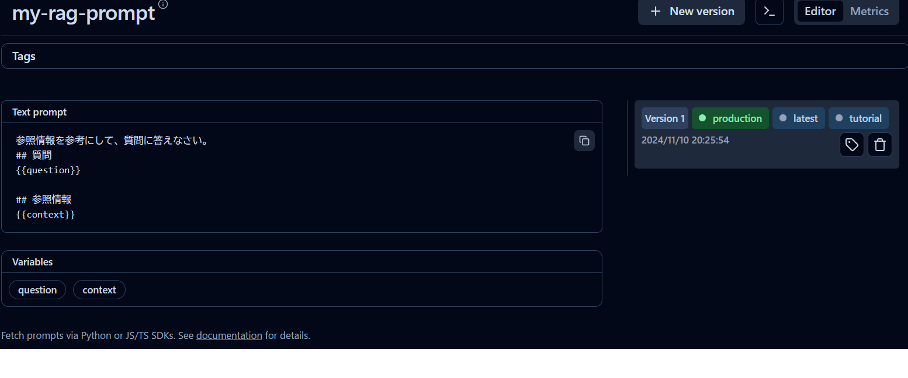
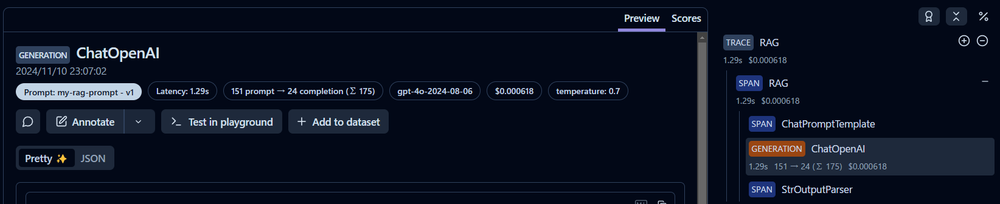

## Langfuse による prompt のバージョン管理

Langfuse による prompt のバージョン管理を行う方法に関する、チュートリアルのためのソースファイル群です。

参考：[Prompt Management](https://langfuse.com/docs/prompts/get-started)

## 実行方法

1. `.env` ファイルを作成して環境変数を記述してください。

```
OPENAI_API_KEY="<your-openai-api-key>"

# このチュートリアルでは以下が必須
LANGFUSE_SECRET_KEY="sk-lf-..."
LANGFUSE_PUBLIC_KEY="pk-lf-..."
LANGFUSE_HOST="https://cloud.langfuse.com" # 🇪🇺 EU region
# LANGFUSE_HOST="https://us.cloud.langfuse.com" # 🇺🇸 US region
```

2. `Dockerfile` を使用してビルドします。

```bash
docker build -t langfuse-prompt .
```

3. ビルドしたイメージを実行してください。`-v`オプションでボリュームをマウントすると、ソースコードの修正がコンテナ環境にも反映されます。

Windows(cmd)の場合
```cmd
docker run -it --rm -v "%cd%":/home/user/app langfuse-prompt /bin/bash
```

4. 所望のスクリプトを実行してください。

```bash
python main.py
```

5. 終了する際は`exit`を入力してください

```bash
exit
```

## ソースコード

[main.py](main.py)

### 1. Langfuse の UI上からプロンプトを作成します。
Langfuse の UI上からプロンプトを作成できます。pythonコードでアップロードすることもできますが、ここでは割愛。




### 2. プロンプトを取得して変換する（Langchainを使用する場合）
`langfuse.get_prompt()` でプロンプトを取得できます。
`langchain` の `ChatPromptTemplate` を使用する場合は、整合性のための処理として `get_langchain_prompt()` を実行する必要があります。また、
トレース結果にプロンプトの情報を盛り込むため、metadata に `langfuse_prompt` を与える必要があります。

```python
from langfuse import Langfuse
from langchain_core.prompts import ChatPromptTemplate

langfuse = Langfuse()

# production のラベルが張られたものが選ばれる。
langfuse_prompt = langfuse.get_prompt(name="my-rag-prompt")

# get_langchain_prompt は langfuse の prompt を langchain に適合するためのメソッド
# 二重カッコ {{}} を一重カッコ {} に変換している。
# 二重カッコで指定する方法を mustache-style という。詳細は mustache.js で検索。
langchain_prompt = ChatPromptTemplate.from_template(
    template=langfuse_prompt.get_langchain_prompt(), 
)

# `langfuse_prompt` のメタデータは実行結果と使用したプロンプトのバージョンを履歴に残すために必要
# langfuse_prompt のメタデータはPromptTemplateのみに設定し、LLMや他のchainに設定しないこと
langchain_prompt.metadata = {"langfuse_prompt": langfuse_prompt}
```

**トレース結果の例**

使用されたプロンプトが `v1` であることが分かります。

