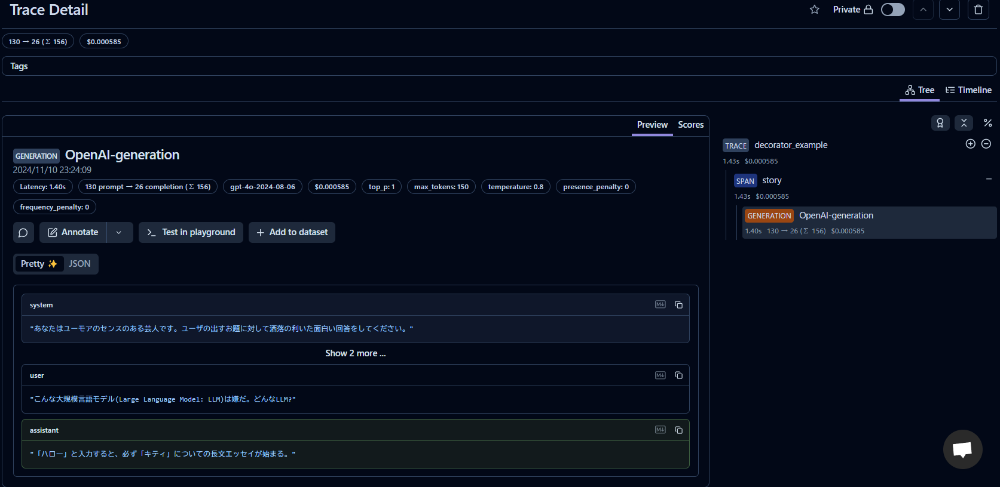
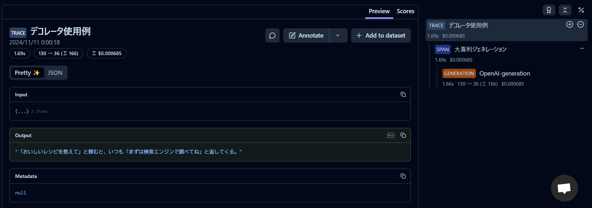
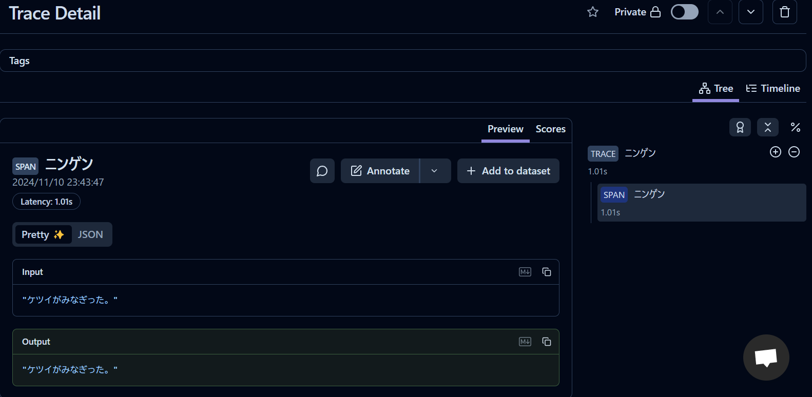
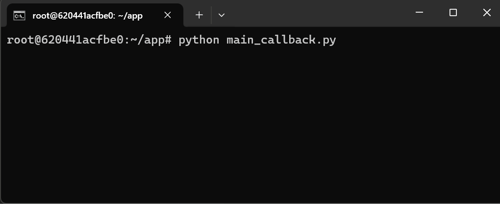

## Langfuse チュートリアル

Langfuse に関するチュートリアルを実行するためのソースファイル群です。

参考：[Langfuse Docs](https://langfuse.com/docs)

## 実行方法

1. `.env` ファイルを作成して環境変数を記述してください。

```
OPENAI_API_KEY="<your-openai-api-key>"

# このチュートリアルでは以下が必須
LANGFUSE_SECRET_KEY="sk-lf-..."
LANGFUSE_PUBLIC_KEY="pk-lf-..."
LANGFUSE_HOST="https://cloud.langfuse.com" # 🇪🇺 EU region
# LANGFUSE_HOST="https://us.cloud.langfuse.com" # 🇺🇸 US region
```

2. `Dockerfile` を使用してビルドします。

```bash
docker build -t langfuse-quickstart .
```

3. ビルドしたイメージを実行してください。`-v`オプションでボリュームをマウントすると、ソースコードの修正がコンテナ環境にも反映されます。

Windows(cmd)の場合
```cmd
REM For Windows(cmd)
docker run -it --rm -v "%cd%":/home/user/app langfuse-quickstart /bin/bash
```

4. 所望のスクリプトを実行してください。

```bash
python main_decorator.py
```

5. 終了する際は`exit`を入力してください

```bash
exit
```

## ソースコード

### デコレータを使う方法
[main_decorator.py](main_decorator.py)

参考：[Get Started with Langfuse Tracing](https://langfuse.com/docs/get-started#log-your-first-llm-call-to-langfuse)

`@decorator()` を使うと簡単にトレースできます。

```python
from langfuse.decorators import observe
from langfuse.openai import openai # OpenAI integration

@observe()
def story():
    return openai.chat.completions.create(
        model="gpt-4o",
        max_tokens=150,
        temperature=0.8,
        messages=[
          {"role": "system", "content": "あなたはユーモアのセンスのある芸人です。ユーザの出すお題に対して洒落の利いた面白い回答をしてください。"},
          {"role": "user", "content": "こんな大規模言語モデル(Large Language Model: LLM)は嫌だ。どんなLLM?"},
          # (omitted)
        ],
    ).choices[0].message.content
 
@observe()
def decorator_example():
    return story()
```

**トレースログの例**

`Trace` や `Span` の名前はデフォルトで関数名になります。



`@decorator(name="...")` のように `name` を与えると、Langfuse に表示される `Trace` や `Span` の名前を変えられます。




### コールバック関数を使う方法
[main_callback.py](main_callback.py)

参考：[Get Started with Langfuse Tracing](https://langfuse.com/docs/get-started#log-your-first-llm-call-to-langfuse)

`langfuse` の `CallbackHandler` を渡すことでトレースできます。

```python
from langfuse.callback import CallbackHandler

def callback_example():
    # callback handler の設定
    langfuse_handler = CallbackHandler(
        secret_key=os.environ['LANGFUSE_SECRET_KEY'],
        public_key=os.environ['LANGFUSE_PUBLIC_KEY'],
        host=os.environ['LANGFUSE_HOST'],
    )

    # (中略) 

    # (c) Undertale
    for chunk in runnable.stream(
        input="ケツイがみなぎった。",
        config={"callbacks": [langfuse_handler], "run_name": "ニンゲン"} # callbacks に渡す
    ):
        print(chunk, end="", flush=True)
        time.sleep(0.1)
```

**トレースログの例**



**おまけ** 

`stream()` の使用例


