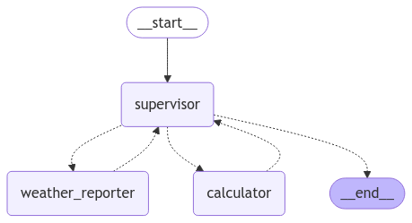
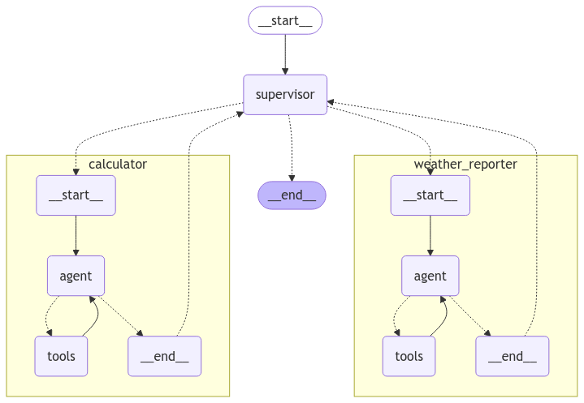
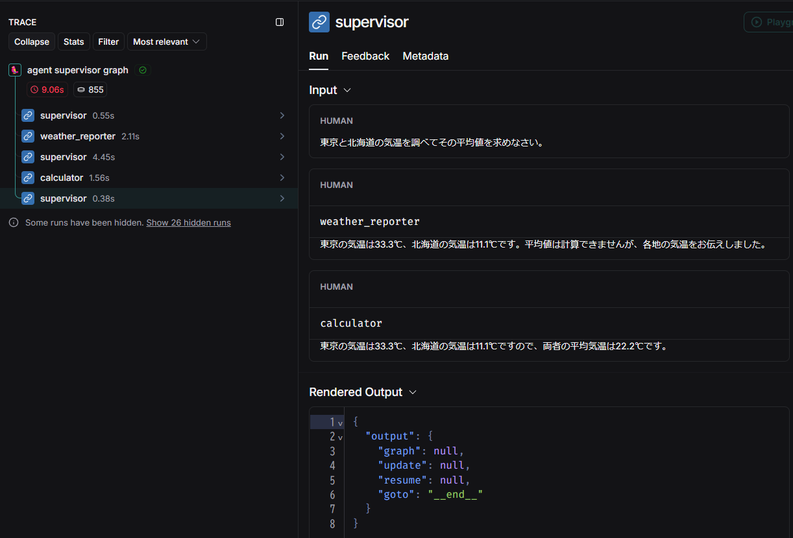

## LangGraph チュートリアル

LangGraph に関するチュートリアルを実行するためのソースファイル群です。

参考：[LangGraph](https://langchain-ai.github.io/langgraph/)

## 実行方法

1. `.env` ファイルを作成して環境変数を記述してください。

```
OPENAI_API_KEY="<your-openai-api-key>"
TAVILY_API_KEY="<your-tavily-api-key>"
LANGCHAIN_TRACING_V2=true
LANGCHAIN_ENDPOINT="https://api.smith.langchain.com"
LANGCHAIN_API_KEY="<your-langsmith-api-key>"
LANGCHAIN_PROJECT="langgraph-multi-agent-systems"
```

2. `Dockerfile` を使用してビルドします。

```bash
docker build -t langgraph-multi-agent-systems .
```

3. ビルドしたイメージを実行してください。`-v`オプションでボリュームをマウントすると、ソースコードの修正がコンテナ環境にも反映されます。

Windows(cmd)の場合
```cmd
docker run -it --rm -v "%cd%":/home/user/app --name langgraph-multi-agent-systems langgraph-multi-agent-systems /bin/bash
```

4. 所望のスクリプトを実行してください。

```bash
python multi_agent_collaboration.py
```

5. 終了する際は`exit`を入力してください

```bash
exit
```

## ソースコード

### マルチエージェントネットワーク

[multi_agent_collaboration.py](multi_agent_collaboration.py)

参考：[Multi-agent network](https://langchain-ai.github.io/langgraph/tutorials/multi_agent/multi-agent-collaboration/)

`create_react_agent` で2つのエージェントを作成し、それらを組み合わせたシステムを構築します。
コードは長いのでソースを参照。

ここではローカルLLMの発表された時期とパラメータサイズを取得し、それらを散布図にプロットするタスクを行わせます。
検索は `researcher` エージェントに、散布図の作成は `python_executor` エージェントに行わせます。

> ⚠️ **Warning**  
> 一度の実行でおよそ **$0.2** かかるので注意してください。また、結果の再現性は低いです。

出来上がったグラフは以下です。


トレース例を示します。


### スーパーバイザ付きのマルチエージェント

[agent_supervisor.py](agent_supervisor.py)

参考：[Multi-agent supervisor](https://langchain-ai.github.io/langgraph/tutorials/multi_agent/agent_supervisor/)

作成したグラフは以下です。`weather_reporter` は地点の気温を返し、`calculator` は2つの数の平均を求めます。



`create_react_agent` で作成した各エージェントの内部を展開すると以下になります。



`supervisor` がはじめに `weather_reporter` を呼んで各地の気温を取得します。
取得した情報は `author = "weather_reporter"` の `HumanMessage` として `messages` に追加されます。
その後、平均値を計算するために `calculator` を呼びます。
`calculator` が最終的な回答を出したため、`supervisor` は終了します。



