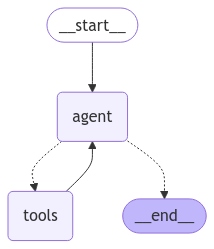
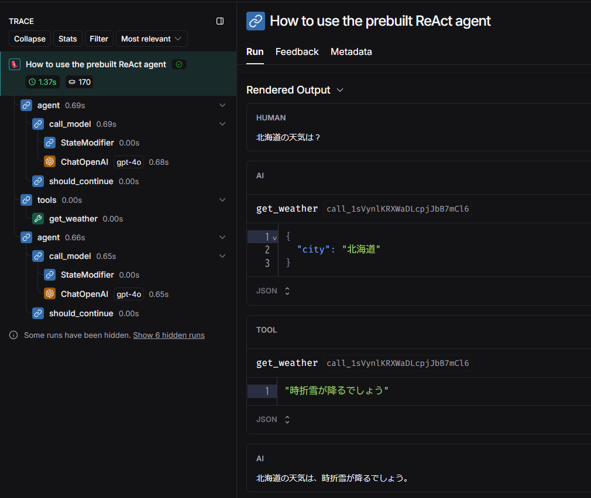
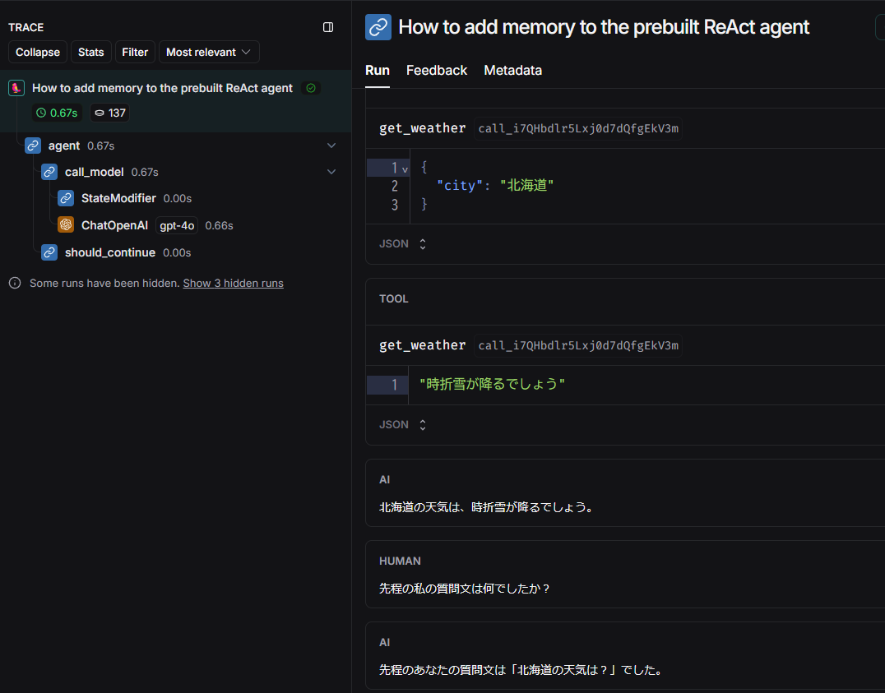
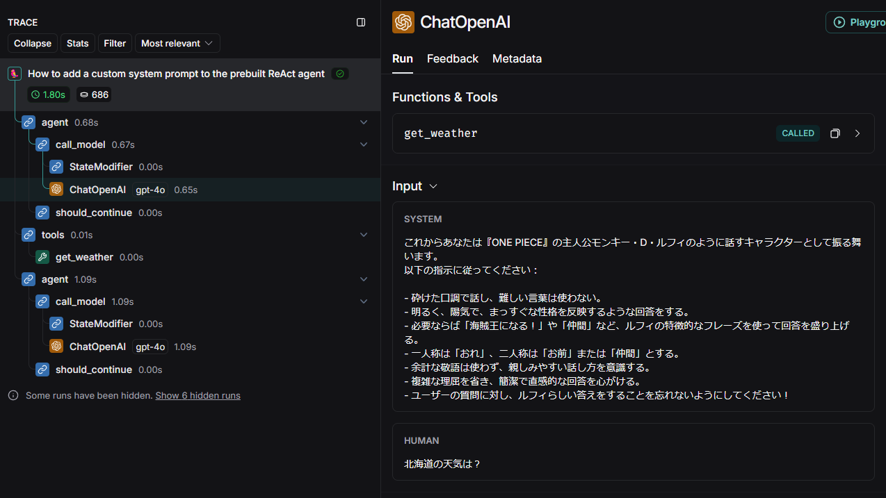
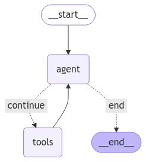
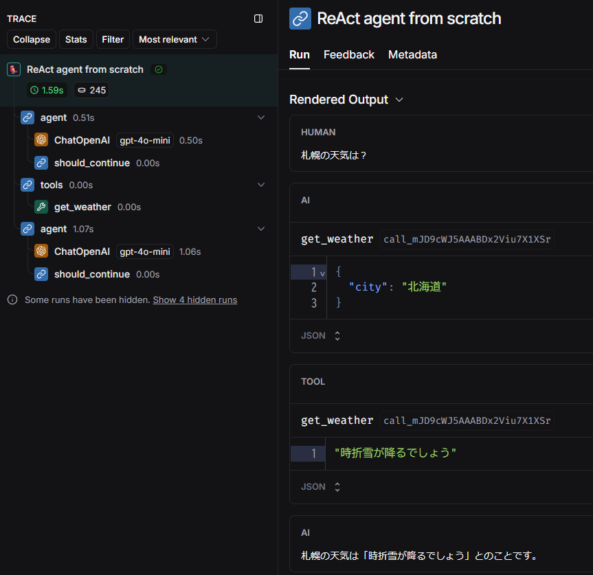

## LangGraph チュートリアル

LangGraph に関するチュートリアルを実行するためのソースファイル群です。

参考：[LangGraph](https://langchain-ai.github.io/langgraph/)

## 実行方法

1. `.env` ファイルを作成して環境変数を記述してください。

```
OPENAI_API_KEY="<your-openai-api-key>"

# Langsmithでトレースする場合は以下4つが必要
# LANGCHAIN_PROJECTは任意の名前を設定できる
LANGCHAIN_TRACING_V2=true
LANGCHAIN_ENDPOINT="https://api.smith.langchain.com"
LANGCHAIN_API_KEY="<your-langsmith-api-key>"
LANGCHAIN_PROJECT="langgraph-prebuilt-react-agent"
```

2. `Dockerfile` を使用してビルドします。

```bash
docker build -t langgraph-prebuilt-react-agent .
```

3. ビルドしたイメージを実行してください。`-v`オプションでボリュームをマウントすると、ソースコードの修正がコンテナ環境にも反映されます。

Windows(cmd)の場合
```cmd
docker run -it --rm -v "%cd%":/home/user/app --name langgraph-prebuilt-react-agent langgraph-prebuilt-react-agent /bin/bash
```

4. 所望のスクリプトを実行してください。

```bash
python create_react_agent.py
```

5. 終了する際は`exit`を入力してください

```bash
exit
```

## ソースコード

### create_react_agent の使い方
[create_react_agent.py](create_react_agent.py)

参考：[How to use the prebuilt ReAct agent](https://langchain-ai.github.io/langgraph/how-tos/create-react-agent/)

`langgraph.prebuilt` にあります。

```python
from langchain_openai import ChatOpenAI
from langgraph.prebuilt import create_react_agent

model = ChatOpenAI(model="gpt-4o", temperature=0)
graph = create_react_agent(model, tools=tools)
```

既にコンパイルされたグラフが出力されます。



トレース例



### create_react_agent にメモリを追加する方法

[create_react_agent_memory.py](create_react_agent_memory.py)

参考：[How to add memory to the prebuilt ReAct agent](https://langchain-ai.github.io/langgraph/how-tos/create-react-agent-memory/)

`Langgraph` の `checkpointer` を追加することで実現できます。

```python
from langgraph.prebuilt import create_react_agent 
from langgraph.checkpoint.memory import MemorySaver
graph = create_react_agent(model, tools=tools, checkpointer=MemorySaver())
```

トレース例



### システムプロンプトをカスタマイズする方法

[create_react_agent_system_prompt.py](create_react_agent_system_prompt.py)

参考：[How to add memory to the prebuilt ReAct agent](https://langchain-ai.github.io/langgraph/how-tos/create-react-agent-memory/)

`state_modifier` にプロンプトを追加します。

```python
# システムプロンプトを追加します
prompt = "これからあなたは..."

from langgraph.prebuilt import create_react_agent
graph = create_react_agent(model, tools=tools, state_modifier=prompt)
```

トレース例



### Human-in-the-loop を追加する方法

[create_react_agent_hitl.py](create_react_agent_hitl.py)

参考：[How to add human-in-the-loop processes to the prebuilt ReAct agent](https://langchain-ai.github.io/langgraph/how-tos/create-react-agent-hitl/)

`tools` ノードに行く前に中断するようにすることで実現できます。

```python
# human-in-the-loop(HITL) の実装するためには checkpointer が必要
from langgraph.checkpoint.memory import MemorySaver
memory = MemorySaver()

# Define the graph
from langgraph.prebuilt import create_react_agent
graph = create_react_agent(
    model, tools=tools, interrupt_before=["tools"], checkpointer=memory
)
```

ツール実行前にツールの入力を変更することができます。

```python
inputs = {"messages": [("user", "札幌の天気は？")]}
config = {"configurable": {"thread_id": "1"}, 
            "run_name": "How to add HITL processes to the prebuilt ReAct agent"}

res = graph.invoke(inputs, config)
ic(res['messages'][-1].tool_calls)
# [{'args': {'city': '札幌'},
#   'id': 'call_KyFxUuUjbvEokCrQsSws0zj1',
#   'name': 'get_weather',
#   'type': 'tool_call'}]

snapshot = graph.get_state(config)
ic("Next step: ", snapshot.next) # ('tools',)

last_message = snapshot.values["messages"][-1]
last_message.tool_calls[0]["args"] = {"city": "北海道"} # 北海道にすり替える
graph.update_state(config, {"messages": [last_message]})

# 続行
res = graph.invoke(None, config)
```

### ReAct エージェントをスクラッチで作る方法

[react_agent_from_scratch.py](react_agent_from_scratch.py)

参考：[How to create a ReAct agent from scratch](https://langchain-ai.github.io/langgraph/how-tos/react-agent-from-scratch/)

まず、グラフの `State` を定義します。

```python
from typing import (
    Annotated,
    Sequence,
    TypedDict,
    Literal
)
from langchain_core.messages import BaseMessage
from langgraph.graph.message import add_messages

class AgentState(TypedDict):
    """The state of the agent."""

    # add_messages は append の意味と思えばよい。
    # 既存のメッセージを上書きする場合は同じ ID を指定する。
    messages: Annotated[Sequence[BaseMessage], add_messages]
```

モデルとツールの定義をします。

```python
from langchain_openai import ChatOpenAI
from langchain_core.tools import tool

model = ChatOpenAI(model="gpt-4o-mini")

@tool
def get_weather(city: Literal["北海道", "東京"]):
    """Use this to get weather information."""
    if city == "北海道":
        return "時折雪が降るでしょう"
    elif city == "東京":
        return "終日晴れるでしょう"
    else:
        raise AssertionError("Unknown city")

tools = [get_weather]
model = model.bind_tools(tools)
```

ノードとエッジの定義をします。

```python
import json
from langchain_core.messages import ToolMessage, SystemMessage
from langchain_core.runnables import RunnableConfig

tools_by_name = {tool.name: tool for tool in tools}


# Define our tool node
def tool_node(state: AgentState):
    outputs = []
    # AI Message の tool_calls を調べて、
    # 呼ばれたツールをすべて実行して ToolMessage として与える
    for tool_call in state["messages"][-1].tool_calls:
        tool_result = tools_by_name[tool_call["name"]].invoke(tool_call["args"])
        outputs.append(
            ToolMessage(
                content=json.dumps(tool_result),
                name=tool_call["name"],
                tool_call_id=tool_call["id"],
            )
        )
    return {"messages": outputs}


# Define the node that calls the model
def call_model(
    state: AgentState,
    config: RunnableConfig,
):
    # this is similar to customizing the create_react_agent with state_modifier, but is a lot more flexible
    system_prompt = SystemMessage(
        "You are a helpful AI assistant, please respond to the users query to the best of your ability!"
    )
    response = model.invoke([system_prompt] + state["messages"], config)
    # We return a list, because this will get added to the existing list
    return {"messages": [response]}


# Define the conditional edge that determines whether to continue or not
def should_continue(state: AgentState):
    messages = state["messages"]
    last_message = messages[-1]
    # ツールが呼ばれてなかったら END へ
    if not last_message.tool_calls:
        return "end"
    # そうでないなら CONTINUE へ
    else:
        return "continue"
```

グラフを定義してコンパイルします。

```python
from langgraph.graph import StateGraph, END

# Define a new graph
workflow = StateGraph(AgentState)
workflow.add_node("agent", call_model)
workflow.add_node("tools", tool_node)
workflow.set_entry_point("agent")
workflow.add_conditional_edges(
    "agent",
    should_continue, # 分岐する条件を記述した関数
    {
        "continue": "tools",
        "end": END,
    },
)

workflow.add_edge("tools", "agent")

from langgraph.checkpoint.memory import MemorySaver
memory = MemorySaver()

# コンパイル時に checkpointer を渡してメモリ機能を追加(tutorialにはない)
graph = workflow.compile(checkpointer=memory)
```

出来上がったグラフは以下です。



トレース例

