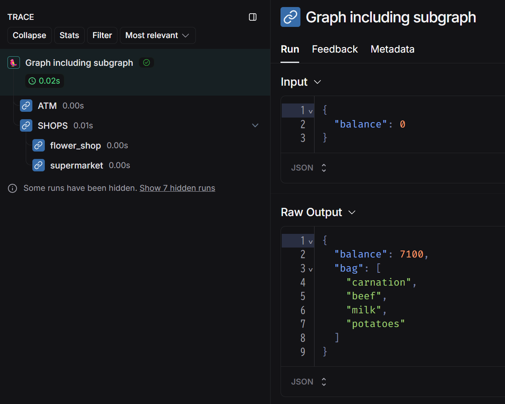

## LangGraph チュートリアル

LangGraph に関するチュートリアルを実行するためのソースファイル群です。

参考：[LangGraph](https://langchain-ai.github.io/langgraph/)

## 実行方法

1. `.env` ファイルを作成して環境変数を記述してください。

```
OPENAI_API_KEY="<your-openai-api-key>"
TAVILY_API_KEY="<your-tavily-api-key>"
LANGCHAIN_TRACING_V2=true
LANGCHAIN_ENDPOINT="https://api.smith.langchain.com"
LANGCHAIN_API_KEY="<your-langsmith-api-key>"
LANGCHAIN_PROJECT="langgraph-subgraph"
```

2. `Dockerfile` を使用してビルドします。

```bash
docker build -t langgraph-subgraph .
```

3. ビルドしたイメージを実行してください。`-v`オプションでボリュームをマウントすると、ソースコードの修正がコンテナ環境にも反映されます。

Windows(cmd)の場合
```cmd
docker run -it --rm -v "%cd%":/home/user/app --name langgraph-subgraph langgraph-subgraph /bin/bash
```

4. 所望のスクリプトを実行してください。

```bash
python how_to_add_and_use_subgraphs.py
```

5. 終了する際は`exit`を入力してください

```bash
exit
```

## ソースコード

### サブグラフの追加方法と使い方

[how_to_add_and_use_subgraphs.py](how_to_add_and_use_subgraphs.py)

参考：[How to add and use subgraphs](https://langchain-ai.github.io/langgraph/how-tos/subgraph/)

まずは通常のグラフと同様の方法でサブグラフを定義します。
ここでは花屋に寄った後にスーパーで買い物をすることを考えます。
花屋ではスーパーで使えるクーポンがもらえます。

```python
from langgraph.graph import START, StateGraph, END
from typing import Annotated, TypedDict, List
from operator import add

# ========================== サブグラフ ==========================
class SubgraphState(TypedDict):
    balance: int
    bag: Annotated[List[str], add]
    coupon: int

def flower_shop(state: SubgraphState):
    balance = state["balance"] - 200
    return {"balance": balance, "bag": ["carnation"], "coupon": 1}

def supermarket(state: SubgraphState):
    price = 3000
    coupon = state["coupon"]
    if coupon > 0:
        price -= 300
        coupon -= 1
    balance = state["balance"] - price
    stuffs = ["beef", "milk", "potatoes"]
    return {"balance": balance, "bag": stuffs, "coupon": coupon}

subgraph_builder = StateGraph(SubgraphState)
subgraph_builder.add_node("flower_shop", flower_shop)
subgraph_builder.add_node("supermarket", supermarket)
subgraph_builder.add_edge(START, "flower_shop")
subgraph_builder.add_edge("flower_shop", "supermarket")
subgraph_builder.add_edge("supermarket", END)
subgraph = subgraph_builder.compile()
```

出来上がったサブグラフは以下です。


サブグラフだけで実行してみましょう。

```python
for chunk in subgraph.stream({"balance": 5000}):
    ic(chunk)
```

```python
ic| chunk: {'flower_shop': {'bag': ['carnation'], 'balance': 4800, 'coupon': 1}}
ic| chunk: {'supermarket': {'bag': ['beef', 'milk', 'potatoes'],
                            'balance': 2100,
                            'coupon': 0}}
```

トレース例


次にサブグラフを親グラフに組み込んでみます。
ここでは買い物に行く前にATMでお金をおろすことを考えます。

`add_node()` メソッドで、サブグラフを親グラフのノードとして組み込んでいることに注目してください。

```python
# ========================== 親グラフ ==========================
class ParentState(TypedDict):
    balance: int
    bag: Annotated[List[str], add]

def atm(state: ParentState):
    return {"balance": 10000}

builder = StateGraph(ParentState)
builder.add_node("ATM", atm)

# コンパイルしたサブグラフを、親グラフのノードとして add_node する
builder.add_node("SHOPS", subgraph)

builder.add_edge(START, "ATM")
builder.add_edge("ATM", "SHOPS")
builder.add_edge("SHOPS", END)
graph = builder.compile()
```

出来上がった全体のグラフは以下です。


実行してみましょう。

```python
for chunk in graph.stream({"balance": 0}):
    ic(chunk)
```

```python
ic| chunk: {'ATM': {'balance': 10000}}
ic| chunk: {'SHOPS': {'bag': ['carnation', 'beef', 'milk', 'potatoes'], 'balance': 7100}}
```

サブグラフからの出力もみたい場合は `subgraphs=True` を指定します。

```python
for chunk in graph.stream({"balance": 0}, subgraphs=True):
    ic(chunk)
```

```python
ic| chunk: ((), {'ATM': {'balance': 10000}})
ic| chunk: (('SHOPS:62e4662f-c70a-20ea-0099-850185cf4a01',),
            {'flower_shop': {'bag': ['carnation'], 'balance': 9800, 'coupon': 1}})
ic| chunk: (('SHOPS:62e4662f-c70a-20ea-0099-850185cf4a01',),
            {'supermarket': {'bag': ['beef', 'milk', 'potatoes'],
                             'balance': 7100,
                             'coupon': 0}})
ic| chunk: ((),
            {'SHOPS': {'bag': ['carnation', 'beef', 'milk', 'potatoes'], 'balance': 7100}})
```

トレース例



`invoke()` 時は最終出力だけっぽいです。

```python
res = graph.invoke({"balance": 0})
ic(res)
```

```python
ic| res: {'bag': ['carnation', 'beef', 'milk', 'potatoes'], 'balance': 7100}
```

#### 親グラフとサブグラフの `State` スキーマが異なる場合

親グラフとサブグラフの `State` スキーマが異なる場合は、サブグラフを実行する前後で変換処理を行う関数を定義する必要があります。

主要な変更箇所のみ示します。

```python
# サブグラフの State スキーマ
class SubgraphState(TypedDict):
    expense: int
    bag: Annotated[List[str], add]
    coupon: int

# 親グラフの State スキーマ
class ParentState(TypedDict):
    balance: int
```

`ParentState` を受け取ってサブグラフを実行し、実行結果を元に `ParentState` を更新するような関数を用意します。

```python
def shopping(state: ParentState):
    # トレースで確認するため。必須でない
    config = {"run_name": "shopping"}

    response = subgraph.invoke({"expense": 0}, config=config)
    return {"balance": state["balance"] - response["expense"]}
```

今度はコンパイルしたサブグラフを与えるのではなく、上記の関数を与えます。

```python
# サブグラフを実行する関数を与える
builder.add_node("SHOPS", shopping)
```

出来上がったグラフは以下で、見た目は先程と同じです。


トレース例


