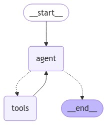

## LangGraph チュートリアル

LangGraph に関するチュートリアルを実行するためのソースファイル群です。

参考：[LangGraph](https://langchain-ai.github.io/langgraph/)

## 実行方法

1. `.env` ファイルを作成して環境変数を記述してください。

```
OPENAI_API_KEY="<your-openai-api-key>"

# Langsmithでトレースする場合は以下4つが必要
# LANGCHAIN_PROJECTは任意の名前を設定できる
LANGCHAIN_TRACING_V2=true
LANGCHAIN_ENDPOINT="https://api.smith.langchain.com"
LANGCHAIN_API_KEY="<your-langsmith-api-key>"
LANGCHAIN_PROJECT="langgraph-tutorial"
```

2. `Dockerfile` を使用してビルドします。

```bash
docker build -t langgraph-tutorial .
```

3. ビルドしたイメージを実行してください。`-v`オプションでボリュームをマウントすると、ソースコードの修正がコンテナ環境にも反映されます。

Windows(cmd)の場合
```cmd
docker run -it --rm -v "%cd%":/home/user/app --name langgraph-tutorial langgraph-tutorial /bin/bash
```

4. 所望のスクリプトを実行してください。

```bash
python simple_agent_example.py
```

5. 終了する際は`exit`を入力してください

```bash
exit
```

## ソースコード

### シンプルなAgentの例
[simple_agent_example.py](simple_agent_example.py)

参考：[LangGraph example](https://langchain-ai.github.io/langgraph/#example)

公式ドキュメントの一番最初に掲載されている例です。
点線はconditional edgeと呼ばれ、ツールが必要な場合は`tools` ノードへ、不要なら `END` ノードに向かいます。




### クイックスタート
[quickstart_chatbot.py](quickstart_chatbot.py)

参考：[LangGraph Quick Start](https://langchain-ai.github.io/langgraph/tutorials/introduction/)

#### パート1: 基本的なチャットボットの構築

Langgraphではチャットボットの構造をステートマシン(有限個の状態を行き来するグラフ)として定義します。
まずは `State` を定義するところから始めます。`State` には reducer functions が含まれ、ここでは新しいメッセージをリストの末尾に追加する `add_messages` が使われます。

```python
from typing import Annotated
from typing_extensions import TypedDict
from langgraph.graph import StateGraph, START, END
from langgraph.graph.message import add_messages

class State(TypedDict):
    messages: Annotated[list, add_messages]

graph_builder = StateGraph(State)
```

次にノードを追加します。`chatbot` ノードは `State` を入力として受け取って、更新された `messages` を返します。これは LangGraph ノードの基本的なパターンです。

```python
llm = ChatOpenAI(model="gpt-4o")

def chatbot(state: State):
    return {"messages": [llm.invoke(state["messages"])]}

# (ノード名, ノードが使われたときに呼ばれる関数)
graph_builder.add_node("chatbot", chatbot)
```

次に開始ノードと終了ノードを定義します。

```python
graph_builder.add_edge(START, "chatbot") # START --> chatbot
graph_builder.add_edge("chatbot", END)   # chatbot --> END
```

最後にコンパイルを行います。

```python
graph = graph_builder.compile()
ic(type(graph)) # <class 'langgraph.graph.state.CompiledStateGraph'>
```

出来上がったグラフは以下です。


実行してみます。通常の `Runnable` と同様に `invoke` します。

```python
user_input = "RAGって何ですか？中学生にもわかるように説明してください。"
result = graph.invoke({"messages": [("user", user_input)]}, 
                        config={"run_name": "(part 1) Basic chatbot"})
```


streaming も可能です。streamingについては [こちら](https://langchain-ai.github.io/langgraph/how-tos/streaming-tokens/#streaming-llm-tokens) を参照。

```python
for msg, metadata in graph.stream(
    {"messages": [("user", user_input)]}, 
    config=config, 
    stream_mode="messages"
):
    print(msg.content, end="|", flush=True)
print("\n")
```


#### パート2: ツールを追加してシンプルな Agent を実装する

このチュートリアルでは `WikipediaQueryRun` を使います。このツールについては [こちら](https://python.langchain.com/docs/integrations/tools/wikipedia/) を参照。

使用例

```python
from langchain_community.tools import WikipediaQueryRun
from langchain_community.utilities import WikipediaAPIWrapper

tool = WikipediaQueryRun(api_wrapper=WikipediaAPIWrapper(top_k_results=2))
ic(tool.invoke("HUNTER X HUNTER"))
```


`ChatModel` にツールをバインドします。それ以外はパート1と同じです。

```python
from typing import Annotated
from typing_extensions import TypedDict
from langgraph.graph import StateGraph, START, END
from langgraph.graph.message import add_messages

class State(TypedDict):
    messages: Annotated[list, add_messages]

graph_builder = StateGraph(State)

llm = ChatOpenAI(model="gpt-4o")
llm_with_tools = llm.bind_tools(tools)

def chatbot(state: State):
    return {"messages": [llm_with_tools.invoke(state["messages"])]}

graph_builder.add_node("chatbot", chatbot)
```

LLM がツールを呼んだら実際にツールを実行する仕組みを実装します。パート3以降では `ToolNode` を使いますが、ここでは理解を深めるために `BasicToolNode` として実装してみます。

```python
import json
from langchain_core.messages import ToolMessage

# main_part3() では ToolNode に置き換える。
class BasicToolNode:
    """A node that runs the tools requested in the last AIMessage."""

    def __init__(self, tools: list) -> None:
        self.tools_by_name = {tool.name: tool for tool in tools}

    def __call__(self, inputs: dict):
        if messages := inputs.get("messages", []):
            message = messages[-1]
        else:
            raise ValueError("No message found in input")
        outputs = []
        for tool_call in message.tool_calls:
            tool_result = self.tools_by_name[tool_call["name"]].invoke(
                tool_call["args"]
            )
            outputs.append(
                ToolMessage(
                    content=json.dumps(tool_result),
                    name=tool_call["name"],
                    tool_call_id=tool_call["id"],
                )
            )
        return {"messages": outputs}

tool_node = BasicToolNode(tools=[tool])
graph_builder.add_node("tools", tool_node)
```

次に条件によって分岐するエッジを定義します。ツールが呼ばれていれば `tools` ノードへ、そうでないなら `END` ノードへ遷移させる関数を定義します。パート3以降では `tools_condition` を使いますが、ここでは理解を深めるために `route_tools()` を実装してみます。

```python
# main_part3() で tools_condition に置き換える
def route_tools(
    state: State,
):
    """
    Use in the conditional_edge to route to the ToolNode if the last message
    has tool calls. Otherwise, route to the end.
    """
    if isinstance(state, list):
        ai_message = state[-1]
    elif messages := state.get("messages", []):
        ai_message = messages[-1]
    else:
        raise ValueError(f"No messages found in input state to tool_edge: {state}")
    if hasattr(ai_message, "tool_calls") and len(ai_message.tool_calls) > 0:
        return "tools"
    return END

graph_builder.add_conditional_edges(
    "chatbot",   # source
    route_tools, # path
    {"tools": "tools", END: END}, # path_map
)
```

残りのエッジを定義してコンパイルしたらグラフの完成です。

```python
graph_builder.add_edge("tools", "chatbot")
graph_builder.add_edge(START, "chatbot")
graph = graph_builder.compile()
```

出来上がったグラフは以下です。点線の矢印は条件分岐するエッジを示します。


実行してみましょう。

```python
user_input = "「推しの子」ってどんな話ですか？"
config={"run_name": "(part 2) Simple agent with a tool"}
result = graph.invoke({"messages": [("user", user_input)]}, 
                        config=config)
print(result['messages'][-1].content)
```

ユーザのクエリを受けてLLMがツールを呼びます。


`wikipedia` ツールを実行して検索したのち、その情報をもとにLLMが応答を生成します。最後の `route_tools` ではその時点でツールが呼ばれていないので `END` が返されます。


#### パート3: メモリ機能を追加する

グラフをコンパイルするときに `checkpointer` を与え、グラフを実行する際に `thread_id` を与えると、グラフは各ステップで状態を自動的に保存します。

```python
from langgraph.checkpoint.memory import MemorySaver

memory = MemorySaver()
```

`MemorySaver` は開発用途でのみ使い、リリースする段階では `SqliteSaver` や `PostgresSaver` などを使うのが良いとされます。

参考：[MemorySaver](https://langchain-ai.github.io/langgraph/reference/checkpoints/#langgraph.checkpoint.memory.MemorySaver)

`ToolNode` と `tools_condition` を使うようになった以外はパート2と同じです。

```python
from typing import Annotated

from langchain_community.tools.tavily_search import TavilySearchResults
from langchain_core.messages import BaseMessage
from typing_extensions import TypedDict

from langgraph.graph import StateGraph, START, END
from langgraph.graph.message import add_messages
from langgraph.prebuilt import ToolNode, tools_condition

class State(TypedDict):
    messages: Annotated[list, add_messages]

graph_builder = StateGraph(State)

from langchain_community.tools import WikipediaQueryRun
from langchain_community.utilities import WikipediaAPIWrapper

tool = WikipediaQueryRun(api_wrapper=WikipediaAPIWrapper(top_k_results=2))
tools = [tool]
llm = ChatOpenAI(model="gpt-4o")
llm_with_tools = llm.bind_tools(tools)


def chatbot(state: State):
    return {"messages": [llm_with_tools.invoke(state["messages"])]}


graph_builder.add_node("chatbot", chatbot)

tool_node = ToolNode(tools=[tool])
graph_builder.add_node("tools", tool_node)

graph_builder.add_conditional_edges(
    "chatbot",
    tools_condition,
)
# Any time a tool is called, we return to the chatbot to decide the next step
graph_builder.add_edge("tools", "chatbot")
graph_builder.add_edge(START, "chatbot")
```

コンパイル時に `checkpointer` を渡します。
```python
graph = graph_builder.compile(checkpointer=memory)
```

出来上がったグラフは以下です。点線の矢印は条件分岐するエッジを示します。


実行してみましょう。

```python
# 会話のキーとして使用するスレッドIDを与える
config = {"configurable": {"thread_id": "1"}, "run_name": "(part 3) Add memory"}

user_input = "こんにちは！私の名前はkossyです！"

# graph を呼ぶときに thread_id を渡す
result = graph.invoke({"messages": [("user", user_input)]}, config)
print(result['messages'][-1].content)
```

記憶していることを確認するクエリを投げてみましょう。

```python
user_input = "私の名前を覚えていますか？"
result = graph.invoke({"messages": [("user", user_input)]}, config)
print(result['messages'][-1].content)
```

確かに覚えていますね。


わざと `thread_id` を変えてみましょう。

```python
config = {"configurable": {"thread_id": "2"}, "run_name": "(part 3) Add memory (thread_id = 2)"}
user_input = "私の名前を覚えていますか？"
result = graph.invoke({"messages": [("user", user_input)]}, config)
print(result['messages'][-1].content)
```

会話の履歴がないので、当然わからないようです。


グラフの `State` について調査したい場合は、 `get_state(config)` を使うと便利です。

```python
config = {"configurable": {"thread_id": "1"}}
snapshot_id1 = graph.get_state(config)
ic(snapshot_id1.values['messages'])
ic(snapshot_id1.next) # ENDステートに到達しているので next は空
```

Langsmithのトレースで確認したように、会話の履歴が入っているのが確認できます（`content` 以外のパラメータは省略しています）。

```bash
ic| snapshot_id1.values['messages']: [HumanMessage(content='こんにちは！私の名前はkossyです！', ...),
                                      AIMessage(content='こんにちは、kossyさん！今日はどんなお手伝いができるでしょうか？', ...),
                                      HumanMessage(content='私の名前を覚えていますか？', ...),
                                      AIMessage(content='はい、あなたの名前はkossyさんですね。何か他にお手伝いできることはありますか ？', ...)]
```

#### パート4: HITL(Human-in-the-loop) を実装する

ツールを実行する前に人間に承認を求めるようにしてみましょう。
グラフの作成はパート3と同じです。
コンパイルする際に `interrupt_before` を追加します。

```python
graph = graph_builder.compile(
    checkpointer=memory,
    interrupt_before=["tools"], # 追加
)
```

出来上がったグラフは以下です。


ツールが呼ばれるようなクエリを投げてみます。

```python
user_input = "Langchain の勉強をしています。 Langchain に関する情報を検索してもらえませんか？"
config = {"configurable": {"thread_id": "1"}, "run_name": "(part 4) Human-in-the-loop"}
result = graph.invoke({"messages": [("user", user_input)]}, config)
```

ツールが呼ばれます。`get_state()` で確認してみましょう。

```python
snapshot = graph.get_state(config)
ic(snapshot.next)
```

今回は next ノードが `tools` に設定されています。`tools` ノードへ行くところで中断していることが分かります。

```bash
ic| snapshot.next: ('tools',)
```

ツールが呼ばれましたが `tools` ノードへは遷移していません。


`None` を入力として実行すると、中断したところから続行することができます。

```python
result = graph.invoke(None, config)
ic(result['messages'][-1].content)
```

`tools` ノードからトレースが始まっています。


#### パート5: ステートを手動で更新する

グラフはパート4と同じです。


今度は `Langgraph` について聞いてみましょう。

```python
user_input = "Langgraph の勉強をしています。Langgraph に関する情報を検索してもらえませんか？"
config = {"configurable": {"thread_id": "1"}, "run_name": "(part 5) Manually Updating the State"}
result = graph.invoke({"messages": [("user", user_input)]}, config)
ic(result['messages'][-1].tool_calls)
```

`Langgraph` について検索をしようとします。

```python
ic| result['messages'][-1].tool_calls: [{'args': {'query': 'Langgraph'},
                                         'id': 'call_e0E7hXSTIrScCuO9OCXXRj32',
                                         'name': 'wikipedia',
                                         'type': 'tool_call'}]
```


実は実装時点ではWikipediaに `Langgraph` のページは存在しません。
なので、こちらで答えを用意してそれを渡しましょう。
ついでに `AIMessage` も作ってしまいます。

```python
snapshot = graph.get_state(config)
existing_message = snapshot.values["messages"][-1]

from langchain_core.messages import AIMessage, ToolMessage

answer = (
    "LangGraphは、LLM(大規模言語モデル)を使用して状態を持つマルチアクターアプリケーションを構築するためのライブラリです。"
)

new_messages = [
    # The LLM API expects some ToolMessage to match its tool call. We'll satisfy that here.
    ToolMessage(content=answer, tool_call_id=existing_message.tool_calls[0]["id"]),
    # And then directly "put words in the LLM's mouth" by populating its response.
    AIMessage(content=answer),
]

# 既存のメッセージに `append` される
graph.update_state(
    config,
    {"messages": new_messages},
)

snapshot = graph.get_state(config)
ic(snapshot.values["messages"])
```

```python
snapshot.values["messages"]: [HumanMessage(content='Langgraph の勉強をしています。Langgraph に関する情報を検索してもらえませんか ？', ...),
                                  AIMessage(content='', ..., tool_calls=[{'name': 'wikipedia', 'args': {'query': 'Langgraph'}, 'id': 'call_eOzGaZbzHuQ4NH4nbKzZ6AXY', 'type': 'tool_call'}], ...),
                                  ToolMessage(content='LangGraphは、LLM(大規模言語モデル)を使用して状態を持つマルチアクターアプリケーションを構築するためのライブラリです。', ...),
                                  AIMessage(content='LangGraphは、LLM(大規模言語モデル)を使用して状態を持つマルチアクターアプリケーションを構築するためのライブラリです。', ...)]
```


`chatbot` ノードから来たかのように扱うこともできます。

```python
# "chatbot" ノードから来たかのように扱う
graph.update_state(
    config,
    {"messages": [AIMessage(content="私はAIのエキスパートです！")]},
    # Which node for this function to act as. It will automatically continue
    # processing as if this node just ran.
    as_node="chatbot",
)
```


メッセージの上書きは、既存のメッセージ ID と同じ ID でメッセージを作成し、`update_state` を行うことで実現できます。

```python
user_input = "Langgraph の勉強をしています。Langgraph に関する情報を検索してもらえませんか？"
config = {"configurable": {"thread_id": "2"}, "run_name": "(part 5) Manually Updating the State"}
result = graph.invoke({"messages": [("user", user_input)]}, config)

from langchain_core.messages import AIMessage

snapshot = graph.get_state(config)
existing_message = snapshot.values["messages"][-1] # 元々は "LangGraph" が呼ばれる予定だった

new_tool_call = existing_message.tool_calls[0].copy()
new_tool_call["args"]["query"] = "LangChain" # 変更した

new_message = AIMessage(
    content=existing_message.content,
    tool_calls=[new_tool_call],
    id=existing_message.id, # 重要: IDが一致していないと置換できない
)

graph.update_state(config, {"messages": [new_message]})

snapshot = graph.get_state(config)
ic(snapshot.values['messages']) # [Human, AI]
ic(snapshot.next) # ('tools',)
```

クエリが `LangChain` に更新されています。


中断しているので続行してみます。

```python
result = graph.invoke(None, config)
print(f"final output: {result['messages'][-1].content}")
"""
final output: "LangChain"は、大規模な言語モデル（LLM）をアプリケーションに統合するためのソフトウェアフレームワークです。このフレーム ワークは、文書の分析や要約、チャットボット、コードの分析など、言語モデルの一般的な使用ケースと大きく重なります。

Langgraphについての特定の情報は見つかりませんでしたが、LangChainがその一部か関連する技術である可能性が考えられます。もしさらに詳細な 情報や特定の側面について知りたい場合、追加の情報を教えてください。
"""

snapshot = graph.get_state(config)
ic(snapshot.values['messages']) # [Human, AI, Tool, AI]
ic(snapshot.next) # ()
```


#### パート6: State をカスタマイズする

`State` にフィールドを追加してみましょう。

```python
from langgraph.checkpoint.memory import MemorySaver
from typing import Annotated
from typing_extensions import TypedDict
from langgraph.graph import StateGraph, START, END
from langgraph.graph.message import add_messages
from langgraph.prebuilt import ToolNode, tools_condition
from langchain_community.tools import WikipediaQueryRun
from langchain_community.utilities import WikipediaAPIWrapper

class State(TypedDict):
    messages: Annotated[list, add_messages]
    ask_human: bool # 追加
```

パート5では強制的に interrupt されましたが、ここではユーザに聞くことでそれを実現することを考えます。

```python
from pydantic import BaseModel # langchain-core >= 0.3

class RequestAssistance(BaseModel):
    """会話を専門家にエスカレーションする。これは、あなたが直接支援できない場合や、ユーザーがあなたの権限を超えたサポートを必要とする場合に使用します。

    この機能を使用するには、ユーザーの 'request' を専門家に伝えて、適切なガイダンスを提供できるようにしてください。
    """

    request: str
```

`chatbot` ノードを定義します。
`ask_human` フラグを立たせる処理が入っています。

```python
tool = WikipediaQueryRun(api_wrapper=WikipediaAPIWrapper(top_k_results=2))
tools = [tool]
llm = ChatOpenAI(model="gpt-4o")
# We can bind the llm to a tool definition, a pydantic model, or a json schema
llm_with_tools = llm.bind_tools(tools + [RequestAssistance])


def chatbot(state: State):
    response = llm_with_tools.invoke(state["messages"])
    ask_human = False
    # RequestAssistance フラグが呼ばれたら ask_human フラグを立てる
    if (
        response.tool_calls
        and response.tool_calls[0]["name"] == RequestAssistance.__name__
    ):
        ask_human = True
    return {"messages": [response], "ask_human": ask_human}
```

`graph_builder` を作ります。

```python
graph_builder = StateGraph(State)
graph_builder.add_node("chatbot", chatbot)
graph_builder.add_node("tools", ToolNode(tools=[tool]))
```

次に `human_node` を作成します。

```python
from langchain_core.messages import AIMessage, ToolMessage

def create_response(response: str, ai_message: AIMessage):
    return ToolMessage(
        content=response,
        tool_call_id=ai_message.tool_calls[0]["id"],
    )

def human_node(state: State):
    new_messages = []
    if not isinstance(state["messages"][-1], ToolMessage):
        new_messages.append(
            create_response("No response from human.", state["messages"][-1])
        )
    return {
        # Append the new messages
        "messages": new_messages,
        # Unset the flag
        "ask_human": False,
    }

graph_builder.add_node("human", human_node)
```

`human` ノードへルーティングするための関数を実装します。

```python
def select_next_node(state: State):
    if state["ask_human"]:
        return "human"
    # Otherwise, we can route as before
    return tools_condition(state)


graph_builder.add_conditional_edges(
    "chatbot",
    select_next_node,
    {"human": "human", "tools": "tools", END: END},
)
```

残りのエッジを定義してコンパイルします。

```python
graph_builder.add_edge("tools", "chatbot")
graph_builder.add_edge("human", "chatbot")
graph_builder.add_edge(START, "chatbot")
memory = MemorySaver()
graph = graph_builder.compile(
    checkpointer=memory,
    # We interrupt before 'human' here instead.
    interrupt_before=["human"],
)
```

出来上がったグラフは以下です。


専門家の意見が必要となるようなクエリを投げてみましょう。

```python
user_input = "AIエージェントを構築するために専門家のサポートが必要です。あなたに専門家を要求します。"
config = {"configurable": {"thread_id": "1"}, "run_name": "(part 6) Customizing state"}
result = graph.invoke({"messages": [("user", user_input)]}, config)
```

`human` ノードへ向かって中断しました。


専門家の応答を生成して `update_state` で更新します。
```python
ai_message = snapshot.values["messages"][-1]
human_response = (
    "ご指名ありがとうございます。我々AIエージェント構築専門家が対応いたします。"
    " LangGraphを使うことで、シンプルな自律型エージェントよりも、はるかに信頼性が高く拡張性のあるエージェントを構築できますよ。"
)
tool_message = create_response(human_response, ai_message)
graph.update_state(config, {"messages": [tool_message]})
```

入力した応答が `ToolMessage` として入っているのが分かります。


最後に中断したところから再開して、出力を確認します。

```python
result = graph.invoke(None, config)
```


#### パート7: 以前の応答から再開する方法

パート6と同じグラフを構築します。


2つクエリを投げます。

```python
config = {"configurable": {"thread_id": "1"}, "run_name": "(part 7) Time travel"}
response = graph.invoke(
    {
        "messages": [
            ("user", "Langchainって何ですか？検索してほしいです。")
        ]
    },
    config,
)

response = graph.invoke(
    {
        "messages": [
            ("user", "便利なフレームワークですね！そもそも言語モデルって何ですか？")
        ]
    },
    config,
)
```

1回目のメッセージの後のトレース


2回目のメッセージの後のトレース


`get_state_history()` で `state` の履歴を見ることができます。
2回目のツールが呼ばれる前の `state` を取得してみましょう。

```python
to_replay = None
for state in graph.get_state_history(config):
    print("Num Messages: ", len(state.values["messages"]), "Next: ", state.next)
    print("-" * 80)
    if len(state.values["messages"]) == 6:
        to_replay = state
```

確かに次のノードは `tools` になっています。

```python
ic(to_replay.next) # ('tools',)
```

続行してみます。

```python
response = graph.invoke(None, to_replay.config)
```

"言語モデル" を検索するところから始まって、最終出力まで生成されます。


