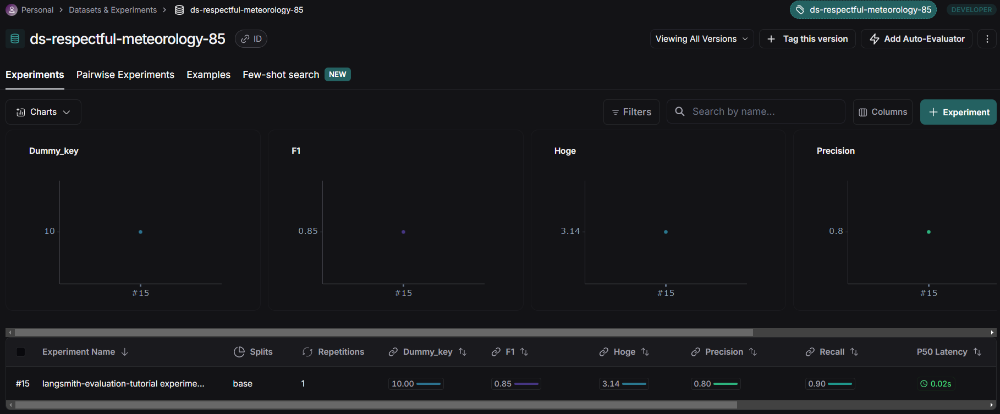
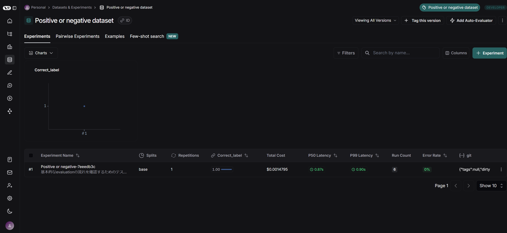
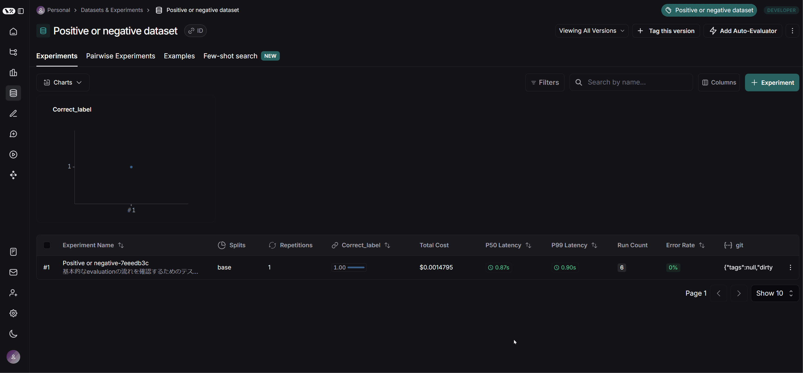
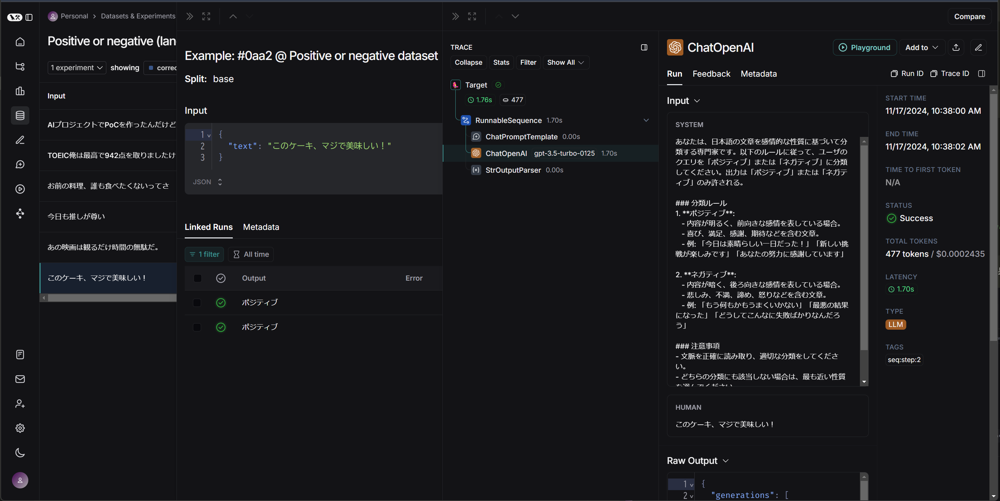

## Langsmith evaluation チュートリアル

LangSmith の Evaluation に関するチュートリアルを実行するためのソースファイル群です。

参考：[Langsmith Evaluation](https://docs.smith.langchain.com/evaluation)

## 実行方法

1. `.env` ファイルを作成して環境変数を記述してください。

```
LANGCHAIN_TRACING_V2=true
LANGCHAIN_ENDPOINT="https://api.smith.langchain.com"
LANGCHAIN_API_KEY="<your-langsmith-api-key>"
LANGCHAIN_PROJECT="langsmith-evaluation-tutorial"
```

2. `Dockerfile` を使用してビルドします。

```bash
docker build -t langsmith-evaluation-tutorial .
```

3. ビルドしたイメージを実行してください。`-v`オプションでボリュームをマウントすると、ソースコードの修正がコンテナ環境にも反映されます。

Windows(cmd)の場合
```cmd
docker run -it --rm -v "%cd%":/home/user/app langsmith-evaluation-tutorial /bin/bash
```

4. 所望のスクリプトを実行してください。

```bash
python main.py
```

5. 終了する際は`exit`を入力してください

```bash
exit
```

## ソースコード

### クイックスタート
[quickstart.py](quickstart.py)

参考：
[Evaluation Quick Start](https://docs.smith.langchain.com/evaluation)

Langsmith から提供されているデータセットをもとに評価を行う例です。`is_concise_enough()` が `Evaluator` になっています。`root_run` は実行結果を表し、出力だけでなく中間ステップ（ツール呼び出し、検索など）も取得できます。`evaluate()` の第一引数は実行対象で、`evaluators` に `Evaluator` を指定します。これは複数設定することができます。

```python
from langsmith import evaluate, Client
from langsmith.schemas import Example, Run

# 1. Create and/or select your dataset
client = Client()
dataset = client.clone_public_dataset("https://smith.langchain.com/public/a63525f9-bdf2-4512-83e3-077dc9417f96/d")

# 2. Define an evaluator
def is_concise_enough(root_run: Run, example: Example) -> dict:
    print(root_run.outputs['output']) # What do mammals and birds have in common? is a good question. I don't know the answer.
    print(example.outputs['answer'])  # They are both warm-blooded
    score = 10
    return {"key": "dummy_key", "score": score}

def hoge_evaluator(root_run: Run, example: Example) -> dict:
    return {"key": "hoge", "score": 3.14}

# 複数のスコアを返すこともできる
# https://docs.smith.langchain.com/evaluation/how_to_guides/evaluation/evaluate_llm_application#return-multiple-scores
def multiple_scores(root_run: Run, example: Example) -> dict:
    return {
        "results": [
            {"key": "precision", "score": 0.8},
            {"key": "recall", "score": 0.9},
            {"key": "f1", "score": 0.85},
        ]
    }

# 3. Run an evaluation
evaluate(
    lambda x: x["question"] + " is a good question. I don't know the answer.",
    data=dataset.name,
    evaluators=[is_concise_enough, hoge_evaluator, multiple_scores],
    experiment_prefix="langsmith-evaluation-tutorial experiment"
)
```

実行結果をUI上で確認すると以下のようになります。`Evaluator` で指定したキーとスコアが記録されているのが分かります。




### 基本的なevaluationの流れ
[basic_evaluation_process.py](basic_evaluation_process.py)

参考：[Run an evaluation](https://docs.smith.langchain.com/evaluation/how_to_guides/evaluation/evaluate_llm_application#run-an-evaluation)

1. タスクを定義します。

```python
# ステップ1 : テキストがポジティブかネガティブかを判定するタスクを定義
@traceable
def label_text(text):
    client_openai = wrappers.wrap_openai(openai.Client())

    system_prompt = "あなたは、日本語の文章を感情的な性質に基づいて分類する専門家です。以下のルールに従って、ユーザのクエリを「ポジティブ」または「ネガティブ」に分類してください。出力は「ポジティブ」または「ネガティブ」のみ許される。\n\n" + \
            "### 分類ルール\n" + \
            "1. **ポジティブ**:\n" + \
            "   - 内容が明るく、前向きな感情を表している場合。\n" + \
            "   - 喜び、満足、感謝、期待などを含む文章。\n" + \
            "   - 例: 「今日は素晴らしい一日だった！」「新しい挑戦が楽しみです」「あなたの努力に感謝しています」\n\n" + \
            "2. **ネガティブ**:\n" + \
            "   - 内容が暗く、後ろ向きな感情を表している場合。\n" + \
            "   - 悲しみ、不満、諦め、怒りなどを含む文章。\n" + \
            "   - 例: 「もう何もかもうまくいかない」「最悪の結果になった」「どうしてこんなに失敗ばかりなんだろう」\n\n" + \
            "### 注意事項\n" + \
            "- 文脈を正確に読み取り、適切な分類をしてください。\n" + \
            "- どちらの分類にも該当しない場合は、最も近い性質を選んでください。\n" + \
            "- 中立的な表現が含まれる場合でも、全体のトーンを考慮して分類してください。\n\n"
    
    messages = [
        {
            "role": "system",
            "content": system_prompt,
        },
        {"role": "user", "content": text},
    ]
    
    result = client_openai.chat.completions.create(
        messages=messages, model="gpt-3.5-turbo-0125", temperature=0
    )
    return result.choices[0].message.content
```

2. データセットを作成します。

既に存在する場合はエラーになってしまうので、ないときだけ作成するようにしています。

```python
# ステップ2 : データセットを作成あるいは読み込み
client_langsmith = Client()

# Create a dataset
examples = [
    ("このケーキ、マジで美味しい！", "ポジティブ"),
    ("あの映画は観るだけ時間の無駄だ。", "ネガティブ"),
    ("今日も推しが尊い", "ポジティブ"),
    ("お前の料理、誰も食べたくないってさ", "ネガティブ"),
    ("TOEIC俺は最高で942点を取りましたけど?", "ポジティブ"),
    ("AIプロジェクトでPoCを作ったんだけど、誰も使ってくれない...", "ネガティブ"),
]

# 既にこのデータセットがある場合は 409 Client Error になるので、ないときだけ作成。
dataset_name = "Positive or negative dataset"
if not client_langsmith.has_dataset(dataset_name=dataset_name):
    dataset = client_langsmith.create_dataset(dataset_name=dataset_name)
    inputs, outputs = zip(
        *[({"text": text}, {"label": label}) for text, label in examples]
    )
    client_langsmith.create_examples(inputs=inputs, outputs=outputs, dataset_id=dataset.id)
```

3. 評価するための `evaluator` を定義します。

ここでは、真の正解と一致すれば `1` 、そうでなければ `0` を出力するようにします。
```python
# ステップ3 : スコアを出力するための evaluator を構成
def correct_label(root_run: Run, example: Example) -> dict:
    score = root_run.outputs.get("output") == example.outputs.get("label")
    return {"score": int(score), "key": "correct_label"}
```

4. テストを実行します。

```python
# ステップ4 : 評価を実行、結果を調査
from langsmith.evaluation import evaluate

results = evaluate(
    lambda inputs: label_text(inputs["text"]),
    data=dataset_name,
    evaluators=[correct_label],
    experiment_prefix="Positive or negative",
    description="基本的なevaluationの流れを確認するためのテストです。",  # optional
)
```

`Dataset & Experiments` から `Positive or negative dataset` を選択すると、以下のようにテスト結果が表示されます。



トレースを有効化しているので、各テスト項目について詳細を確認することができます。



### langchain の `Runnable` を評価する方法
[evaluate_langchain_runnable.py](evaluate_langchain_runnable.py)

参考：[Evaluate a LangChain runnable](https://docs.smith.langchain.com/evaluation/how_to_guides/evaluation/evaluate_llm_application#evaluate-a-langchain-runnable)

データセットの登録は[前節](#基本的なevaluationの流れ)で定義したものを使用します。

`chain.invoke` を `evalute()` に渡せばよいです。データセットの入力のキー名と `chain` の入力変数名を一致させる必要があることに注意してください。ここでは `text` です。詳細は[前節](#基本的なevaluationの流れ)のステップ2を参照してください。

以下はプログラムの要点だけをかいつまんだものです。

```python
prompt = ChatPromptTemplate.from_messages([
    ("system", system_prompt),
    ("user", "{text}") # データセット作成時の入力のキー名と一致しないとエラー。
])

chain = prompt | chat_model | output_parser

dataset_name = "Positive or negative dataset"

results = evaluate(
    chain.invoke, # chain.invoke を渡す
    data=dataset_name,
    evaluators=[correct_label],
    experiment_prefix="Positive or negative (langchain runnable)",
    description="langchainのrunnableを使ってテストを実施しています。",
)
```

langchainの `Runnable` を評価した場合、各ステップの詳細も見られます。



