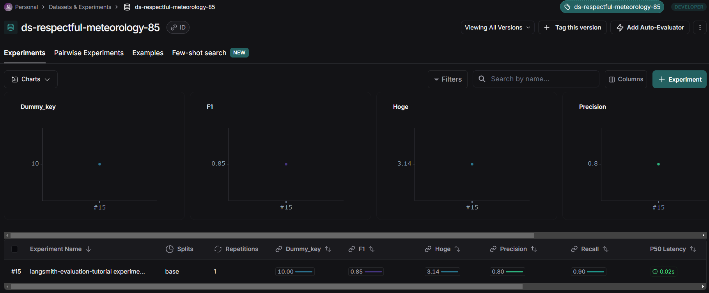

## Langsmith evaluation チュートリアル

LangSmith の Evaluation に関するチュートリアルを実行するためのソースファイル群です。

参考：[Langsmith Evaluation](https://docs.smith.langchain.com/evaluation)

## 実行方法

1. `.env` ファイルを作成して環境変数を記述してください。

```
LANGCHAIN_TRACING_V2=true
LANGCHAIN_ENDPOINT="https://api.smith.langchain.com"
LANGCHAIN_API_KEY="<your-langsmith-api-key>"
LANGCHAIN_PROJECT="langsmith-evaluation-tutorial"
```

2. `Dockerfile` を使用してビルドします。

```bash
docker build -t langsmith-evaluation-tutorial .
```

3. ビルドしたイメージを実行してください。`-v`オプションでボリュームをマウントすると、ソースコードの修正がコンテナ環境にも反映されます。

Windows(cmd)の場合
```cmd
docker run -it --rm -v "%cd%":/home/user/app langsmith-evaluation-tutorial /bin/bash
```

4. 所望のスクリプトを実行してください。

```bash
python main.py
```

5. 終了する際は`exit`を入力してください

```bash
exit
```

## ソースコード

[main.py](main.py)

参考：
[Evaluation Quick Start](https://docs.smith.langchain.com/evaluation)

Langsmith から提供されているデータセットをもとに評価を行う例です。`is_concise_enough()` が `Evaluator` になっています。`root_run` は実行結果を表し、出力だけでなく中間ステップ（ツール呼び出し、検索など）も取得できます。`evaluate()` の第一引数は実行対象で、`evaluators` に `Evaluator` を指定します。これは複数設定することができます。

```python
from langsmith import evaluate, Client
from langsmith.schemas import Example, Run

# 1. Create and/or select your dataset
client = Client()
dataset = client.clone_public_dataset("https://smith.langchain.com/public/a63525f9-bdf2-4512-83e3-077dc9417f96/d")

# 2. Define an evaluator
def is_concise_enough(root_run: Run, example: Example) -> dict:
    print(root_run.outputs['output']) # What do mammals and birds have in common? is a good question. I don't know the answer.
    print(example.outputs['answer'])  # They are both warm-blooded
    score = 10
    return {"key": "dummy_key", "score": score}

def hoge_evaluator(root_run: Run, example: Example) -> dict:
    return {"key": "hoge", "score": 3.14}

# 複数のスコアを返すこともできる
# https://docs.smith.langchain.com/evaluation/how_to_guides/evaluation/evaluate_llm_application#return-multiple-scores
def multiple_scores(root_run: Run, example: Example) -> dict:
    return {
        "results": [
            {"key": "precision", "score": 0.8},
            {"key": "recall", "score": 0.9},
            {"key": "f1", "score": 0.85},
        ]
    }

# 3. Run an evaluation
evaluate(
    lambda x: x["question"] + " is a good question. I don't know the answer.",
    data=dataset.name,
    evaluators=[is_concise_enough, hoge_evaluator, multiple_scores],
    experiment_prefix="langsmith-evaluation-tutorial experiment"
)
```

実行結果をUI上で確認すると以下のようになります。`Evaluator` で指定したキーとスコアが記録されているのが分かります。




