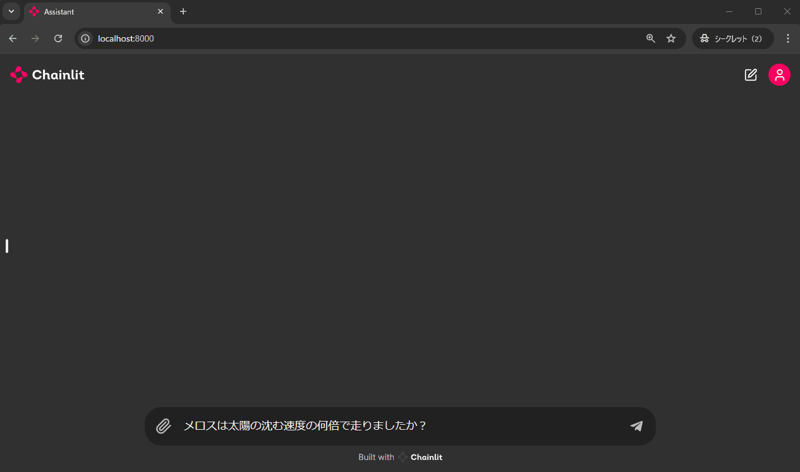
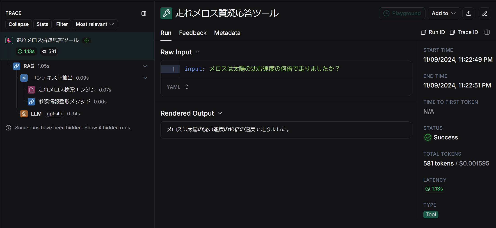

## 走れメロス検索アプリ（chainlit）

「走れメロス」の検索を行うアプリをchainlitで実装したものです。

### 技術要素
- RAGの基本構成
- `Retriever` および `Tool` の実装
- コールバック関数 `on_retriever_end()` を用いて参照情報をUI上に表示する

### デモ・トレースログ





## 実行方法

1. `.env` ファイルを作成して環境変数を記述してください。

```
OPENAI_API_KEY="<your-openai-api-key>"
HF_TOKEN="<your-hf-token>"

# Langsmithでトレースする場合は以下4つが必要
# LANGCHAIN_PROJECTは任意の名前を設定できる
LANGCHAIN_TRACING_V2=true
LANGCHAIN_ENDPOINT="https://api.smith.langchain.com"
LANGCHAIN_API_KEY="<your-langsmith-api-key>"
LANGCHAIN_PROJECT="run_melos_cl_app"
```

2. `Dockerfile` を使用してビルドします。

```bash
docker build -t run_melos_cl_app .
```

3. ビルドしたイメージを実行してください。`-v`オプションでボリュームをマウントすると、ソースコードの修正がコンテナ環境にも反映されます。

Windows(cmd)の場合
```cmd
docker run -it --rm -v "%cd%":/home/user/app -p 8000:8000 run_melos_cl_app /bin/bash
```

Linuxの場合
```bash
docker run -it --rm -v "$(pwd)":/home/user/app -p 8000:8000 run_melos_cl_app /bin/bash
```

4. app.py を実行し、[http://localhost:8000/](http://localhost:8000/) にアクセスしてください。

```bash
chainlit run app.py --host 0.0.0.0
```

5. 終了する際は`exit`を入力してください

```bash
exit
```

