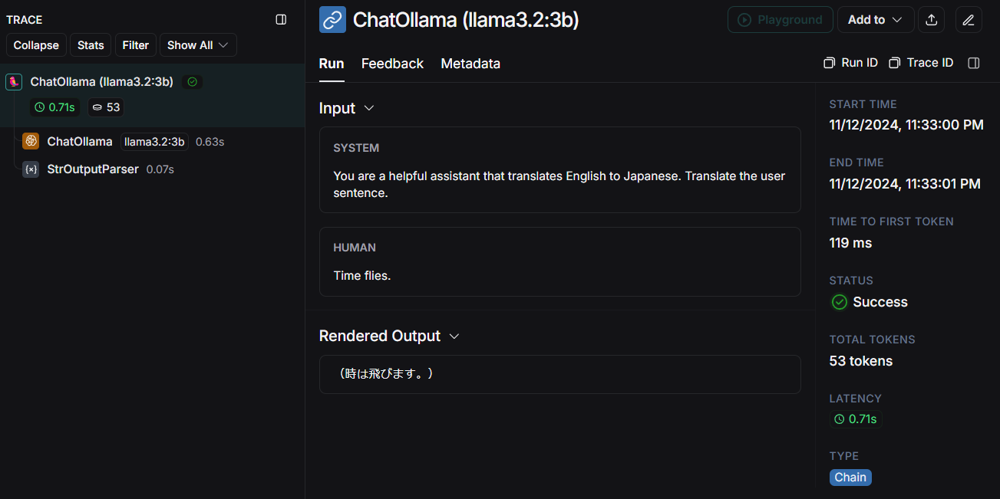

## Ollama チュートリアル
このチュートリアルでは、Docker環境上でOllamaモデルをセットアップし、Pythonスクリプトから [ChatOllama](https://python.langchain.com/docs/integrations/chat/ollama/) を使用して言語モデルを活用する方法について説明します。

1. Ollamaコンテナの起動

以下のコマンドを実行し、Ollama用のDockerコンテナをバックグラウンドで起動します。コンテナはホストマシンのポート11434にマッピングされ、`/root/.ollama` ディレクトリがボリュームとして永続化されます。
```bash
docker run -d -v ollama:/root/.ollama -p 11434:11434 --name ollama ollama/ollama
```

Ollamaイメージについての詳細は、[ollama/ollama](https://hub.docker.com/r/ollama/ollama)を参照ください。

2. Ollamaコンテナにアクセス

モデルのダウンロードや設定を行うため、起動したコンテナに接続します。
```bash
docker exec -it ollama /bin/bash
```

3. モデルのダウンロード

以下のコマンドを実行し、Ollamaからモデルをダウンロードします。ここでは例として `llama3.2:3b` モデルを使用します。
```bash
ollama pull llama3.2:3b
```

Ollamaで使用可能なモデルは [Ollama Model Library](https://ollama.com/library) に記載されています。必要なモデルを選択してダウンロードしてください。

4. Python環境の構築と実行

Pythonスクリプトを実行するために、Python環境用のコンテナを構築・起動します。

Windows(cmd)の場合
```bash
docker build -t ollama-tutorial .
docker run -it --rm -v "%cd%":/home/user/app --name ollama-tutorial ollama-tutorial /bin/bash
```

5. 所望のスクリプトを実行してください。

```bash
python main.py
```

## ソースコード
[main.py](main.py)

`langchain-ollama` ライブラリを使用し、ダウンロードしたOllamaモデルにアクセスします。
コンテナからホスト上のサービスに接続する場合は `host.docker.internal` を指定します（参考：[I want to connect from a container to a service on the host](https://docs.docker.com/desktop/features/networking/#i-want-to-connect-from-a-container-to-a-service-on-the-host)）。


```python
from langchain_core.output_parsers import StrOutputParser
from langchain_ollama import ChatOllama

def main():
    model_name = "llama3.2:3b"
    llm = ChatOllama(
        model=model_name,
        temperature=0.2,
        base_url="http://host.docker.internal:11434",
        seed=0 # 結果を再現したいときは乱数の種を指定する
        # other params...
    )

    messages = [
        (
            "system",
            "You are a helpful assistant that translates English to Japanese. Translate the user sentence. ",
        ),
        ("human", "Time flies."),
    ]
    chain = llm | StrOutputParser()
    ai_msg = chain.invoke(messages, {"run_name": f"ChatOllama ({model_name})"})
    print(ai_msg) # "（時は飛びます。）" 「光陰矢の如し」にはならなかった
```

### トレースログの例



## 参考
- [ChatOllama (Langchain)](https://python.langchain.com/docs/integrations/chat/ollama/)
- [Models (Ollama)](https://ollama.com/library)
- [ollama (Github)](https://github.com/ollama/ollama)
- [ollama/ollama (Docker hub)](https://hub.docker.com/r/ollama/ollama)
- [I want to connect from a container to a service on the host (dockerdocs)](https://docs.docker.com/desktop/features/networking/#i-want-to-connect-from-a-container-to-a-service-on-the-host)